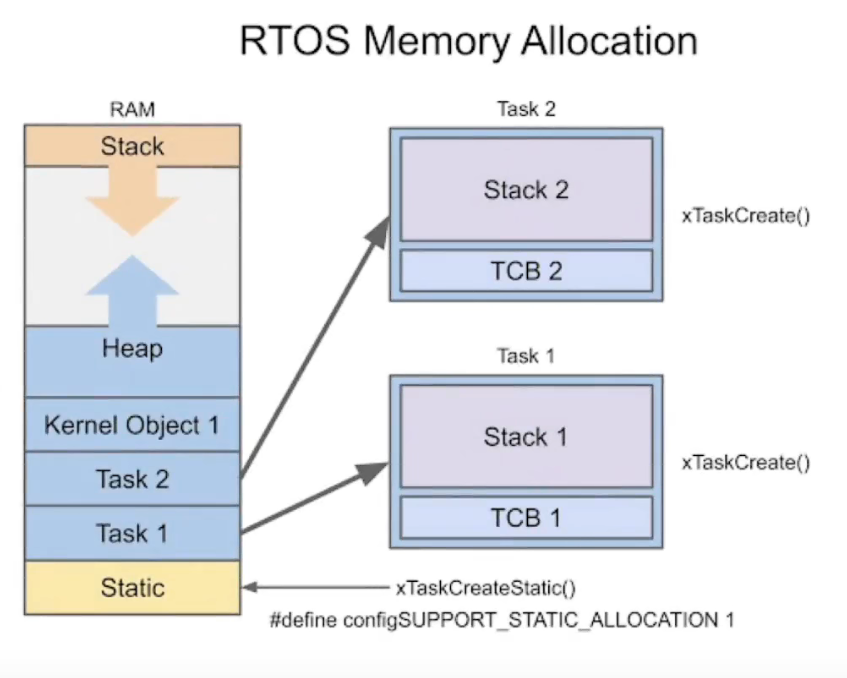

# 内存


Static区域：静态部分存放静态变量，字符串，全局变量等

栈stack：局部变量（函数内部的变量）实时操作系统的现场保护、返回地址都是存储在栈

堆Heap：malloc()函数动态分配的内存就属于堆的空间。xTaskCreate创建的任务会在Heap中动态分配

TCB ：Task control board，记录任务状态，任务终止时状态以及如何恢复的状态
task中的stack区才是用户可以使用的内存

# 
```c++
/*
  程序： 内存管理
  公众号：孤独的二进制
  API：
    ESP.getHeapSize() //本程序Heap最大尺寸
    ESP.getFreeHeap() //当前Free Heap最大尺寸
    uxTaskGetStackHighWaterMark(taskHandle) //Task内存使用最大水位线。也就是任务会用到的最大内存
     
    What is the Highest Water Mark?
    the minimum amount of remaining stack space that was available to the task 
    since the task started executing - that is the amount of stack that remained 
    unused when the task stack was at its greatest (deepest) value. This is what 
    is referred to as the stack 'high water mark'.
*/
TaskHandle_t taskHandle;//任务句柄
int taskMem = 1024;

void task(void *ptParam) {
  //volatile char hello[1000] = {0}; //必须要用volatile修饰语，否则会被编译器优化掉
  while (1) {

    //不推荐在task中执行，因为Serial.print也会消耗内存
    // vTaskDelay(2000);
    // int waterMark = uxTaskGetStackHighWaterMark(nullptr);//在任务中调用时，空指针即代表任务本身
    // Serial.print("Task Free Memory: ");
    // Serial.print(waterMark);
    // Serial.println(" Bytes");
    // Serial.print("Task Used Memory: ");
    // Serial.print(taskMem - waterMark);
    // Serial.println(" Bytes");
    // Serial.println("");

  }
}
void setup() {
  Serial.begin(115200);

  int heapSize = ESP.getHeapSize();
  Serial.print("Total Heap Size:  ");
  Serial.print(heapSize);
  Serial.println(" Bytes");

  int heapFree = ESP.getFreeHeap();
  Serial.print("Free Heap Size:  ");
  Serial.print(heapFree);
  Serial.println(" Bytes");
  Serial.println("");


  Serial.println("Create Task ...");
  xTaskCreate(task, "", taskMem, NULL, 1, &taskHandle);

  Serial.print("Free Heap Size:  ");
  Serial.print(ESP.getFreeHeap());
  Serial.println(" Bytes");
  Serial.println("");

  vTaskDelay(2000);
  int waterMark = uxTaskGetStackHighWaterMark(taskHandle);
  Serial.print("Task Free Memory: ");
  Serial.print(waterMark);
  Serial.println(" Bytes");
  Serial.print("Task Used Memory: ");
  Serial.print(taskMem - waterMark);
  Serial.println(" Bytes");

}

void loop() {

}
```

## 如果很多任务都需要向串口输出数据，一般建立一个单独的任务只负责串口通信，其他任务都向该任务传输数据