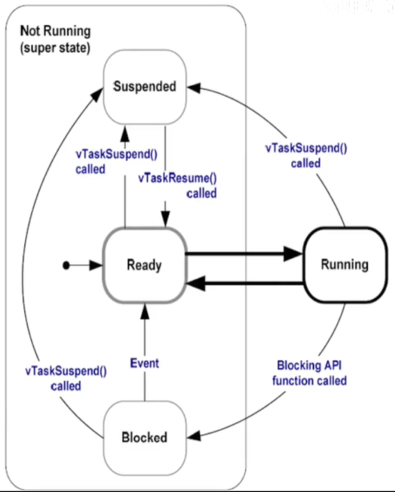

# 任务状态



## ready和Blocked

xTaskCreate()创建的任务就会进入到Ready状态但是没有运行，一般任务创建完成后，进入就绪态；

处于就绪态的任务，如果没有更高优先级或同优先级的任务正在运行，它会自动进入运行态；

如果有更高优先级的任务要运行，或者同优先级的任务要轮流运行，它会从运行态返回到就绪态；

如果任务需要等待某个事件，或者任务自己进入了系统延时（vTaskDelay()），则会进入阻塞态Blocked；当等待的事件达到后，任务又会进入就绪态。

## 挂起（暂停）Suspended

## 删除任务delete

```c++
/*
  程序： 任务管理https://wokwi.com/projects/332867530330735188
  公众号：孤独的二进制
  API：
    BaseType_t xTaskCreate(,,,,,); //任务创建
    void vTaskDelete( TaskHandle_t xTask ); //任务删除 
    void vTaskSuspend( TaskHandle_t xTaskToSuspend ); //任务暂停
    void vTaskResume( TaskHandle_t xTaskToResume ); //任务恢复
*/
#include <LiquidCrystal_I2C.h>
LiquidCrystal_I2C lcd(0x27, 20, 4);

TaskHandle_t biliHandle = NULL; //Task Handler

void control(void *ptParam) {  //按钮控制
  
  pinMode(32, INPUT_PULLUP);
  pinMode(33, INPUT_PULLUP);
  pinMode(25, INPUT_PULLUP);
  pinMode(26, INPUT_PULLUP);

  while (1) {
    // 创建任务
    if (digitalRead(32) == LOW) {
      //判断是否之前已经创建了Bilibili channel task， 如果没有创建，则创建该Task
      if (biliHandle == NULL) {
        if (xTaskCreate(radioBilibili, "Bilibili Channel", 1024 * 8, NULL, 1, &biliHandle) == pdPASS) {
          Serial.print(xTaskGetTickCount());
          Serial.println(" - LOG: Task is Created.");
        } else {
          Serial.print(xTaskGetTickCount());
          Serial.println(" - WARNING: Unable to Create Task.");
        }
      } else {
        Serial.print(xTaskGetTickCount());
        Serial.println(" - WARNING: Task **WAS** Created.");
      }
      vTaskDelay(120); //粗暴的Button Debounce
    }

    //任务删除
    if (digitalRead(33) == LOW) {
      //注意在删除任务前，一定要确保任务是存在的
      //删除不存在的任务，比如连续删除两次，自动重启
      if (biliHandle != NULL) {
        vTaskDelete( biliHandle );
        lcdClear(); //清空LCD
        biliHandle = NULL; //手动将handler设置为空
      }

      if (biliHandle != NULL) {
        Serial.print(xTaskGetTickCount());
        Serial.println(" - WARNING: Unable to Delete Task.");
      } else {
        Serial.print(xTaskGetTickCount());
        Serial.println(" - LOG: Task is Deleted.");
      }
      vTaskDelay(120);  //粗暴的Button Debounce
    }

    // 任务暂停
    if (digitalRead(25) == LOW) {
      if (biliHandle != NULL) {
        vTaskSuspend(biliHandle);
        Serial.print(xTaskGetTickCount());
        Serial.println(" - LOG: Task is suspended.");
      } else {
        Serial.print(xTaskGetTickCount());
        Serial.println(" - WARNING: Unable to Suspend Task.");
      }
      vTaskDelay(120);  //粗暴的Button Debounce
    }

    // 任务恢复
    if (digitalRead(26) == LOW) { 
      if (biliHandle != NULL) {
        vTaskResume(biliHandle);
        Serial.print(xTaskGetTickCount());
        Serial.println(" - LOG: Task is resumed.");
      } else {
        Serial.print(xTaskGetTickCount());
        Serial.println(" - WARNING: Unable to Resume Task.");
      }
      vTaskDelay(120);  //粗暴的Button Debounce
    }
  }
}

void radioBilibili(void *ptParam) {  //任务主体

  lcd.init();
  lcd.backlight();
  lcd.setCursor(0, 0);
  lcd.print(" Bilibili   Channel ");
  lcd.setCursor(0, 1);
  lcd.print("-FreeRTOS on EPS32- ");
  lcd.setCursor(0, 2);
  lcd.print("Study Hard  &  Smart");

  while (1) {
    lcd.setCursor(9, 3);
    lcd.print(xTaskGetTickCount() / 100);
    vTaskDelay(100);
  }
}

void lcdClear() { //清空LCD
  lcd.clear();
  lcd.noBacklight();
  lcd.setCursor(0, 0);
  lcd.print("                                                                                                    ");
}

void setup()
{
  Serial.begin(115200);
  xTaskCreate(control, "control panel", 1024 * 8, NULL, 1, NULL);
}


void loop() {}
```

## 注意delet()之前一定要判断任务句柄是否为空

1、判断是否为空NULL
2、删除任务
3、将节点句柄置为空NULL

```c++
      //注意在删除任务前，一定要确保任务是存在的
      //删除不存在的任务，比如连续删除两次，自动重启
      if (biliHandle != NULL) {
        vTaskDelete( biliHandle );
        lcdClear(); //清空LCD
        biliHandle = NULL; //手动将handler设置为空
      }
```