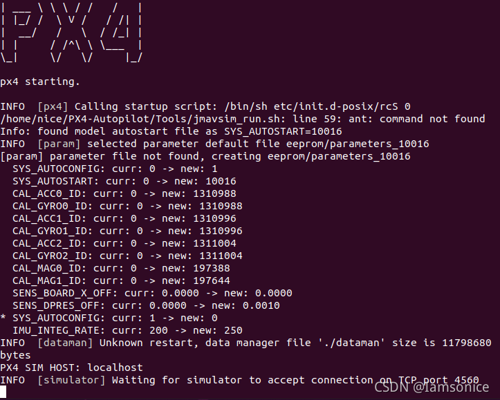

git clone https://github.com/PX4/PX4-Autopilot.git

运行配置环境脚本
bash ./PX4-Autopilot/Tools/setup/ubuntu.sh

cd PX4-Autopilot

切换到想要的分支
git checkout v1.13.0-beta2

如果有必要，清理build环境

make clean
make distclean

更新子模块
make submodulesclean

也可以直接递归克隆，但是很容易网络问题
git clone https://github.com/PX4/PX4-Autopilot.git --recursive

可以先将PX4文件克隆下来，不去克隆子项目
git clone https://github.com/PX4/PX4-Autopilot.git
然后切换到PX4文件夹，继续克隆子项目,不断执行git submodule update --recursive直到不出现失败提示
cd PX4-Autopilot
git submodule update --init --recursive

编译：

make holybro_kakuteh7_default

22.04报错

问题是找不到ant
sudo apt  install ant

后面仍然会报错：

这个虽然能查到，但是和官网文档里面解决方法没用。
虽然都有这一句Exception in thread "main" java.lang.reflect.InvocationTargetException
但是，下面几行具体的报错我的是：
Caused by: java.lang.UnsatisfiedLinkError: Can't load library: /usr/lib/jvm/java-11-openjdk-amd64/lib/libawt_xawt.so

按照官网的方法

https://docs.px4.io/main/en/simulation/jmavsim.html#java-awt-awterror-assistive-technology-not-found-org-gnome-accessibility-atkwrapper

会让你把一行代码给注释，但是ubuntu22的情况下，你会发现它已经注释了！

真实原因是openjdk-11-jdk没安装，一句apt-get 解决
sudo apt install openjdk-11-jdk

有人会教你用openjdk-8-jdk，不需要，PX4在ubuntu22用的是openjdk-11-jdk

现在，jMAVSim已经可以正常跑起来了，但是输入command takeoff 不能起飞。需要开一下QGC地面站，连接之后就可以正常起飞降落了。

gazebo 仿真

FAILED: external/Stamp/sitl_gazebo-classic/sitl_gazebo-classic-configure 
