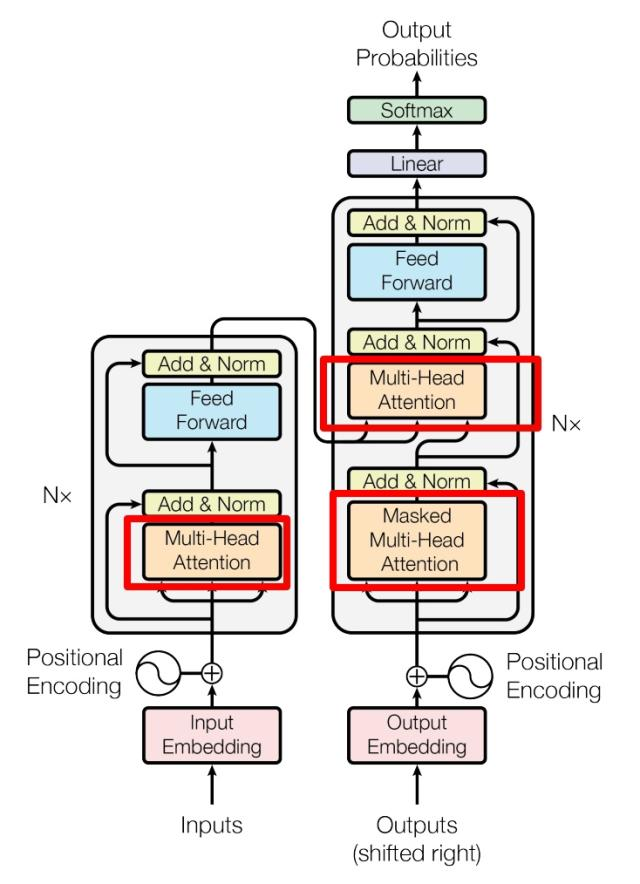
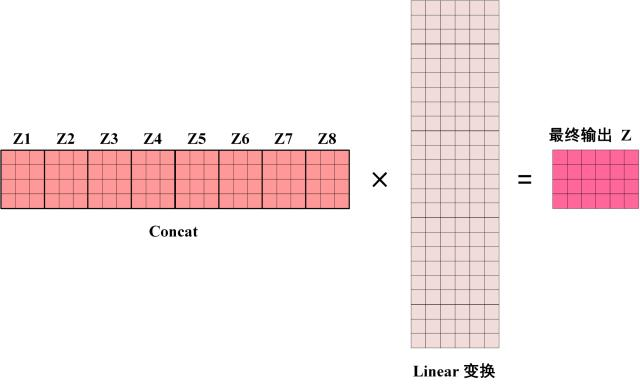
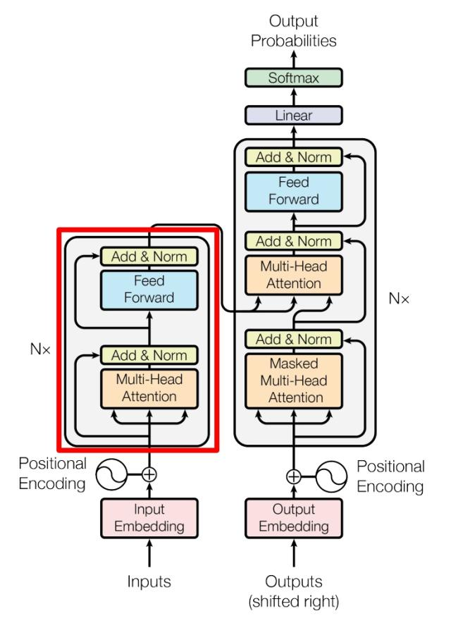
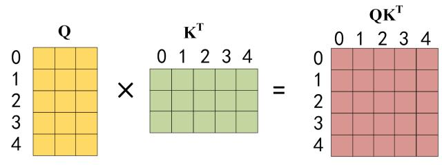
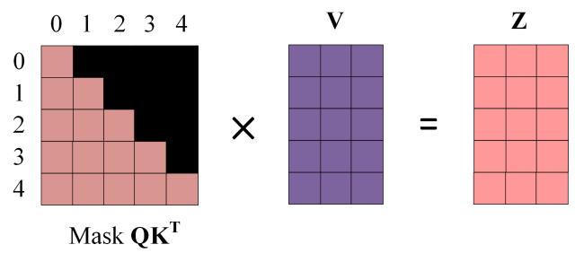
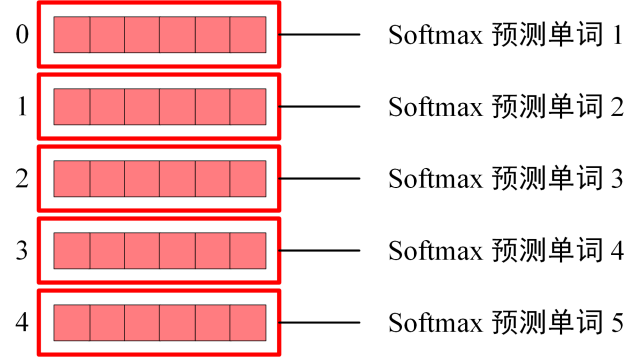
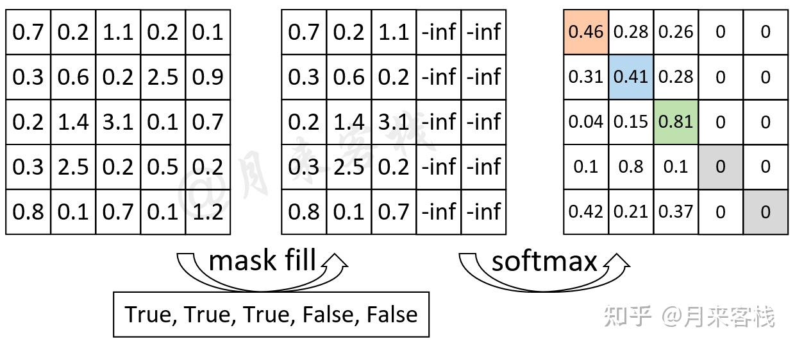

# 1.总体结构


**第一步**：获取输入句子的每一个单词的表示向量$x$，$x$由单词Embedding（Embedding就是从原始数据提取出来的Feature）和单词的位置的Embedding相加得到（他们维度相同，相加指的是对应位置相加）。


**第二步**：将得到的单词表示向量矩阵$X$ (图所示，每一行是一个单词的表示向量$X$)传入 Encoder 中，经过 6 个 Encoder block 后可以得到句子所有单词的编码信息矩阵 $C$ ，如下图。单词向量矩阵用 $X_{n \times d}$ 表示， $n$ 是句子中单词个数，$d$ 是表示向量的维度 (论文中 $d=512$)。

**注意** 每一个 Encoder block 输出的矩阵维度与输入完全一致。

**第三步**：将 Encoder 输出的编码信息矩阵 $C$ 传递到 Decoder 中，Decoder 依次会根据当前翻译过的单词 $1 \sim i$ 翻译下一个单词 $i+1$，如下图所示。

在**推理**过程中，Decoder 接收了 Encoder 的编码矩阵 $C$，然后首先输入一个翻译开始符 "<Begin>"，预测第一个单词 "I"；然后输入翻译开始符 "<Begin>" 和单词 "I"，预测单词 "have"，以此类推。这是 Transformer 使用时候的大致流程，接下来是里面各个部分的细节。

在**训练**的过程中，Decoder 接收了 Encoder 的编码矩阵 $C$，以及**标签（真值、标准答案）进行训练**，而不是像推理过程中使用上一个预测的state预测下一个单词。这个叫做 **teacher-forcing**

https://www.cnblogs.com/dangui/p/14690919.html

但是这里有个问题，我们推理的时候是一个单词一个单词往外蹦的，是根据上一个单词以及$C$的信息预测下一个单词。这里把真值（翻译好的一串文字）直接输入进去显然是不行的，因为网络在推理单词 "I" 的时候，其实已经看到这个地方就是 "I" 并且后面的的几个单词也都知道了，这样网络在训练过程中会学到直接照输入的单词。所以，做法是Decoder翻译到单词 $i+1$ 的时候需要通过 **Mask(掩盖)** 操作遮盖住 $i+1$ 之后的单词。


## 2.Embedding

Transformer 中单词的输入表示 x由 Code Embedding 和 Positional Encoding 相加得到。


## 2.1 Code Embedding

单词的 Embedding 其实就是将每个单词变成一个向量，最简单的一种方式就是 One hot （独热向量）

当然，这里有单词编码方式，例如可以采用 Word2Vec、Glove 等算法预训练得到，也可以在 Transformer 中训练得到。

## 2.2 Positional Encoding

Transformer 中除了单词的 Embedding，还需要使用位置 Embedding 表示单词出现在句子中的位置。

因为 Transformer 不采用 RNN 的结构，而是使用全局信息，不能利用单词的顺序信息。

而这部分表示单词之间相对位置的信息对于 NLP 来说非常重要。所以 Transformer 中使用位置 Embedding 保存单词在序列中的相对或绝对位置。

（RNN的结构天然的利用了单词的顺序信息，但是Transformer是一次输入所有的单词，并行化操作，所以需要将位置信息也编码进表示向量里面）

位置 Embedding 用 **PE** 表示，**PE** 的维度与单词 Embedding 是一样的。**PE** 可以通过训练得到，也可以使用某种公式计算得到。在 Transformer 中采用了后者，计算公式如下：


其中，$pos$ 表示 **单词** 在 **句子** 中的位置，$d$ （有些地方会写$d_{model}$） 表示 $PE$ 的维度 (与词 Embedding 一致)。$2i$ 表示偶数的维度，$2i+1$ 表示奇数维度。

使用这种公式计算 PE 有以下的好处：

* 使 PE 能够适应比训练集里面所有句子更长的句子，假设训练集里面最长的句子是有 20 个单词，突然来了一个长度为 21 的句子，则使用公式计算的方法可以计算出第 21 位的 Embedding。
* 可以让模型容易地计算出相对位置，对于固定长度的间距 $k$，$PE(pos+k)$ 可以用 $PE(pos)$ 计算得到。因为 $Sin(A+B) = Sin(A)Cos(B) + Cos(A)Sin(B), Cos(A+B) = Cos(A)Cos(B) - Sin(A)Sin(B)$。

将单词的词 Embedding 和位置 Embedding 维度相同，直接相加，就可以得到单词的表示向量 $x$ ，将一整句话的$N$个单词Embedding $x_i$摞在一起，形成矩阵$X$，$X$ 就是 Transformer 的输入。

$X$的shape是 $batchsize \times N \times d_{model}$

# 3.Multi-head-Attention 多头注意力



上图是论文中 Transformer 的内部结构图，左侧为 Encoder block，右侧为 Decoder block。红色圈中的部分为 Multi-Head Attention，是由多个并行的Self-Attention组成的。

可以看到 Encoder block 包含一个 Multi-Head Attention，而 Decoder block 包含两个 Multi-Head Attention (其中有一个用到 Masked)。

Multi-Head Attention 上方还包括一个 Add & Norm 层，Add 表示残差连接 (Residual Connection) 用于防止网络退化，Norm 表示 Layer Normalization，用于对每一层的激活值进行归一化。

因为 Self-Attention是 Transformer 的重点，所以我们重点关注 Multi-Head Attention 以及 Self-Attention，首先详细了解一下 Self-Attention 的内部逻辑。

## 3.1  Self-Attention（自注意力机制）

### 3.1.1 $Q$, $K$, $V$ 的计算

Self-Attention 的输入用矩阵$X$进行表示，则可以使用线性变换将输入 $x$ 映射为矩阵 Q,K,V。

在代码里面这一步通过一个 **全连接层** 实现。

$$ Q = W^Q \times X $$
$$ K = W^K \times X $$
$$ V = W^V \times X $$


**注意** X, Q , K, V 的每一**行**表示一个单词。

然后，使用Q, K, V 计算self-attention: 


上图是 Self-Attention 的结构。

在实际中，Self-Attention 接收的是输入(单词的表示向量$x$组成的矩阵$X$) 或者上一个 Encoder block 的输出。

写成公式为：


$Q$乘以$K^T$，得到的 $n \times n$ 维矩阵（$n$ 为句子单词数）

这个矩阵可以表示单词之间的 attention 强度。

下图为$Q \times K^T$ ，1234 表示的是句子中的第几个单词。


公式中计算矩阵$Q$和$$每一行向量的内积，为了防止内积过大，因此除以 $\sqrt{d_k}$ 对应 *Scale* 步骤

*Mask*是可选的，在encoder中没有使用。

得到 $\frac{Q K^T}{ \sqrt{d_k} }$ 之后，使用 Softmax 计算每一个单词对于其他单词的 attention 系数（关联度）。

公式中的 Softmax 是对矩阵的每一行进行 Softmax，即每一行的和都变为 1.（一个单词对于其他所有单词的关联度加起来应该是1）


得到 Softmax 矩阵之后可以和V相乘，得到最终的输出Z。


上图中 Softmax 矩阵的第 1 行表示单词 1 与其他所有单词的 attention 系数，最终输出矩阵的第一行$Z_1$对应单词1

$Z_1$等于所有单词 i 的值 $V_i$ 根据 attention 系数的比例加在一起得到（相当于乘了个权重），如下图所示：


## 3.2 Multi-Head Attention

Multi-Head Attention 是由多个 Self-Attention 组合形成的，下图是论文中 Multi-Head Attention 的结构图。


从上图可以看到 Multi-Head Attention 包含多个 Self-Attention 层，首先将输入 $X$ 分别传递到 $h$ 个**不同**的 Self-Attention 中，计算得到 $h$ 个输出矩阵 $Z$。下图是 $h=8$ 时候的情况，此时会得到 8 个输出矩阵Z。


**注意** $h$个Self-Attention是不同的，并不能共享参数。因为他们要捕获不同的Attention信息。所有有几个head(Self-Attention)就需要用几套不同的 Q K V

得到 8 个输出矩阵 $Z_1$ 到 $Z_8$ 之后，Multi-Head Attention 将它们拼接在一起 (Concat)，然后传入一个Linear层，得到 Multi-Head Attention 最终的输出Z。



可以看到 Multi-Head Attention 输出的矩阵$Z$与其输入的矩阵$X$的维度是一样的。


# 4 Encoder



上图红色部分是 Transformer 的 Encoder block 结构，可以看到是由 Multi-Head Attention, Add & Norm, Feed Forward, Add & Norm 组成的。现在了解一下 Add & Norm 和 Feed Forward 部分。

## 4.1 Add & Norm

Add & Norm 层由 残差连接(Add) 和 层归一化（Layer Norm） 两部分组成，在 Multi-head 和 Feedforward 层之后各自经过了一个Add & Norm 层，分别的计算公式如下：


其中 $X$ 表示 Multi-Head Attention 或者 Feed Forward 的输入，MultiHeadAttention(X) 和 FeedForward(X) 表示输出 (输出与输入 X 维度是一样的，所以可以相加)。

Add 指 X + MultiHeadAttention(X)，是一种残差连接，通常用于解决多层网络训练的问题，可以让网络只关注当前差异的部分，在 ResNet 中经常用到：


Norm指 Layer Normalization，通常用于 RNN 结构，Layer Normalization 会将该的输入都转成均值方差都一样的，这样可以加快收敛。

**注意**区分 Layer Normalization 和 Batch Normalization

### Add & Norm 的顺序

在论文中，输入矩阵 $X$ 先经过了multi-head-attention 然后进行了 Add （$X + attention(x)$）之后进行norm，如下如图：


而在代码实现中，大家往往将norm放在Add之前进行，这个在pytorch的transformer的函数里面有参数 *norm_first* 可以选择这个顺序

参考以下论文：

On Layer Normalization in the Transformer Architecture (2020)

虽然原始Transformer论文中的图很好地展现了编码器-解码器架构，但与具体代码实现存在细微差异，比如层归一化（LayerNorms）在残差块之间等，文中显示的变体也被称为Post-LN Transformer。
Transformer架构论文中的层归一化表明Pre-LN也很有效，解决了梯度问题，许多模型也在实践中采用Pre-LN，缺点在于可能会导致表示秩崩溃。
虽然业界关于使用Post-LN还是Pre-LN仍然存在争论，但最近有一篇新论文提出同时利用这两种方法，不过在实践中是否有用仍然需要进一步观察。


## 4.2 Feed Forward

Feed Forward 层比较简单，是一个两层的全连接层，第一层的激活函数为 Relu，第二层不使用激活函数，对应的公式如下。


X是输入，Feed Forward 最终得到的输出矩阵的维度与X一致。

4.3 组成 Encoder
通过上面描述的 Multi-Head Attention, Feed Forward, Add & Norm 就可以构造出一个 Encoder block，Encoder block 接收输入矩阵 $X_{n\times d}$，并输出一个矩阵 
$C_{n\times d}$。通过多个 Encoder block 叠加就可以组成 Encoder。

第一个 Encoder block 的输入为句子单词的表示向量矩阵，后续 Encoder block 的输入是前一个 Encoder block 的输出，最后一个 Encoder block 输出的矩阵就是编码信息矩阵 $C$，这一矩阵后续会用到 Decoder 中。


## Sublayer


# 5.Decoder


上图红色部分为 Transformer 的 Decoder block 结构，与 Encoder block 相似，但是存在一些区别：

* 包含两个 Multi-Head Attention 层。
* 第一个 Multi-Head Attention 层采用了 Masked 操作。
* 第二个 Multi-Head Attention 层的K, V矩阵使用 Encoder 的编码信息矩阵C进行计算，而Q使用上一个 Decoder block 的输出计算。
* 最后有一个 Softmax 层计算下一个翻译单词的概率。


## 5.1 第一个 Multi-Head Attention
Decoder block 的第一个 Multi-Head Attention 采用了 Masked 操作，因为在翻译的过程中是顺序翻译的，即翻译完第 i 个单词，才可以翻译第 i+1 个单词。

在 teacher forcing 训练过程中通过 Masked 操作，可以防止第 i 个单词知道 i+1 个单词之后的信息。

下面以 "我有一只猫" 翻译成 "I have a cat" 为例，了解一下 Masked 操作。


下面的描述中使用了类似 Teacher Forcing 的概念，在 Decoder 的时候，是需要根据之前的翻译和原文的信息$C$，求解当前最有可能的翻译，如下图所示。首先根据输入 "\Begin" 预测出第一个单词为 "I"，然后根据输入 "\Begin I" 预测下一个单词 "have"。


Decoder 在训练的过程中使用 Teacher Forcing 并且并行化训练。那么在预测第 i 个输出时，就要将第 i+1 之后的单词掩盖住，注意 Mask 操作是在 Self-Attention 的 Softmax 之前使用的，下面用 0 1 2 3 4 5 分别表示 \Begin I have a cat \End"。

**第一步**：是 Decoder 的输入矩阵和 Mask 矩阵，输入矩阵包含 "\Begin I have a cat" (0, 1, 2, 3, 4) 五个单词的表示向量，Mask 是一个 5×5 的矩阵。在 Mask 可以发现单词 0 只能使用单词 0 的信息，而单词 1 可以使用单词 0, 1 的信息，即只能使用之前的信息。


**第二步**：接下来的操作和之前的 Self-Attention 一样，通过输入矩阵 $X$ 计算得到 $Q,K,V$ 矩阵。然后计算 $Q K^T$



**第三步**：在得到 $Q K^T$ 之后 进行 Softmax，计算 attention score之前，需要使用Mask矩阵遮挡住每一个单词之后的信息，遮挡操作如下：


得到 Masked $Q K^T$ 之后在 Masked $Q K^T$ 上进行 Softmax，每一行的和都为 1。但是单词 0 在单词 1, 2, 3, 4 上的 attention score 都为 0。

**第四步**：使用 Masked $Q K^T$ 与矩阵 V相乘，得到输出 $Z$，则单词 1 的输出向量是只包含单词 1 信息的。




**第五步**：通过上述步骤就可以得到一个 Masked Self-Attention 的输出矩阵。和 Encoder 类似，通过 Multi-Head Attention 拼接多个输出 $Z_i$ 然后计算得到第一个 Multi-Head Attention 的输出 $Z$ ，$Z$ 与输入 $X$ 维度一样。

## 5.2 第二个 Multi-Head Attention

Decoder block 第二个 Multi-Head Attention 变化不大， 主要的区别在于其中 Self-Attention 的 $K$, $V$ 矩阵不是使用 上一个 Decoder block 的输出计算的，而是使用 Encoder 的编码信息矩阵 $C$ 计算的。

根据 Encoder 的输出 $C$ 计算得到 $K$. , $V$，根据上一个 Decoder block 的输出 $Z$ 计算 $Q$ (如果是第一个 Decoder block 则使用输入矩阵 $X$ 进行计算)，后续的计算方法与之前描述的一致。

这样做的好处是在 Decoder 的时候，每一位单词都可以利用到 Encoder 所有单词的信息 (这些信息无需 Mask)。

## 5.3 Softmax 预测输出单词

Decoder block 最后的部分是利用 Softmax 预测下一个单词，在之前的网络层我们可以得到一个最终的输出 Z，因为 Mask 的存在，使得单词 0 的输出 Z0 只包含单词 0 的信息，如下：


Softmax 根据输出矩阵的每一行预测下一个单词：





# Pad mask

在encoder和decoder两个模块里都有padding mask，位置是在softmax之前，对$QK^T$的结果进行mask。

## 目的

encoder和decoder两个模块都会有各自相应的输入，但是输入的句子长度是不一样的。

为了并行化操作，需要将一个batch中的所有句子用pad符号补齐到同样的长度。

但是用pad符号填充的位置的信息是没有意义的，计算得到的$QK^T$注意力矩阵表示词与词之间的相关性，而pad符号本身是我们添加的，不应该与其他词有相关性，所以在求softmax之前应该将这些位置遮盖掉。

在训练时将$QK^T$矩阵与pad符号对应的列给Mask掉，具体操作是将这些位置置为**负无穷**。做softmax操作时，这些值求出来的$e^i \approx 0$。


## 具体操作
在代码实现中，mask往往是这样做的

```python
def get_attn_pad_mask(seq_q, seq_k):
    '''
    seq_q: [batch_size, seq_len] 用于提取Q矩阵的句子的长度
    seq_k: [batch_size, seq_len] 用于提取K矩阵的句子的长度
    seq_len could be src_len or it could be tgt_len
    seq_len in seq_q and seq_len in seq_k maybe not equal
    '''
    batch_size, len_q = seq_q.size()
    batch_size, len_k = seq_k.size()
    # eq(zero) is PAD token
    pad_attn_mask = seq_k.data.eq(0).unsqueeze(1)  # [batch_size, 1, len_k], False is masked
    return pad_attn_mask.expand(batch_size, len_q, len_k)  # [batch_size, len_q, len_k]
```

注意这里最后面`pad_attn_mask.expand(batch_size, len_q, len_k)`只是将pad_attn_mask复制了len_q行，也就是下面的过程。


得到的mask矩阵与注意力矩阵$QK^T$形状相同，在求softmax之前将注意力矩阵$QK^T$中对应mask矩阵中标记的位置（橙色）置为负无穷。

## 为什么只mask列上面的padding

不管是encoder还是decoder都只是mask了注意力矩阵$QK^T$的与pad相关的列，而行并没有置为负无穷，下面做出解释

### 先来解释为什么encoder中只mask列上面的padding

假如现在编码器的输入内容是序列“我 是 谁 P P”，其中P表示padding部分的信息，那么其分别进行词线性变换后（乘$W^q,W^k,W^v$）便得到了Q、K和V这3个矩阵。进一步，Q与K作用便得到了注意力权重矩阵:


<center style="font-size:14px;color:#C0C0C0;text-decoration:underline">图1.Padding时注意力计算过程图</center> 


如果直接求softmax，此时的注意力权重对于Padding位置上的信息也会加以考虑。因此在Transformer中，作者通过在生成训练集的过程中记录下每个样本Padding的实际位置；然后再将注意力权重矩阵中对应位置的权重替换成负无穷便达到了忽略Padding位置信息的目的，


<center style="font-size:14px;color:#C0C0C0;text-decoration:underline">图2.Padding掩码计算过程图</center> 

如图2所示，对于”我 是 谁 P P“这个序列来说，前3个字符是正常的，后2个字符是Padding后的结果。因此，其Mask向量便为`[True, True, True, False, False]`。通过这个Mask向量（下面称之为`src_key_padding_mask`）可知，需要将权重矩阵的最后两列替换成负无穷以此来达到忽略掉padding部分的信息。

此时，问题就来了，**为什么不对注意力矩阵中的最后两行也进行mask处理**（如图3右所示），它代表的不也是padding部分的信息吗？


<center style="font-size:14px;color:#C0C0C0;text-decoration:underline">图3.两种mask</center> 

先说结论：

* 1. 计算问题，次要原因 如果一整行都是负无穷，softmax()计算时分母是0 ，无法计算。

* 2. 直接原因，权重矩阵与$V$作用后得到的结果Memory在与Decoder中Multi-Head Attention交互时，最后两行padding部分的内容在那里进行了mask处理（转置操作使得最后两行又变成了最后两列）


假如图3中左边的权重矩阵与V作用后的结果如图4所示，此时我们可以知道Z中最后两行的信息本质上也是属于padding部分的内容。（按道理来说如果权重矩阵的最后两行全为0 ，那么Z中**最后两行**的结果也将全部为0而被忽略掉。）


<center style="font-size:14px;color:#C0C0C0;text-decoration:underline">图4.encoder中单头注意力权重计算过程图</center> 

多个注意力头的Z矩阵拼接就是encoder的输出——Memory矩阵。


进一步，假定decoder的输入经过第一个Multi-Head Attention处理后输出tgt矩阵，编码器的输出Memory矩阵（$Z$经过线性变换后的结果）。这两个矩阵在第二个Multi-Head Attention（交互注意力层）通过线性层变成tgt(Q)，Memory(V) 和 Memory(K)

（按道理，如果上图4中Z的最后两行均为0，那么Memory(K)的最后两行也应该为0，然后计算得到的图5 $QK^T$ 注意力权重矩阵的**最后两列**将会全部为0。）


<center style="font-size:14px;color:#C0C0C0;text-decoration:underline">​图 5. decoder中单头注意力权重矩阵计算过程图</center>

接着，图5中的注意力矩阵将会进行mask操作，而此时encoder-decoder交互部分的maks向量就是图2中的mask向量。因此，整个mask过程如图6所示。


<center style="font-size:14px;color:#C0C0C0;text-decoration:underline">​图6. encoder-decoder单头注意力mask计算过程图</center>

如图6所示，图5中的注意力矩阵也要经过同样的mask操作，在经过mask操作后，注意力矩阵的**最后两列**全部变成了0。**与我们假设在图4的步骤里将Z中最后两行置为0的效果一致**，从而也就达到了后面可以忽略掉图4里Z中最后两行信息的目的。


<center style="font-size:14px;color:#C0C0C0;text-decoration:underline">​图7. encoder-decoder单头注意力计算过程图</center>

如图7所示，由于此时权重注意力矩阵的最后两列均为0，那么其在于encoder输出部分memory作用时，memory中最后两行padding部分的信息自然就得到了忽略。此时便可以看出，即使在encoder里图4中注意力权重矩阵的最后两行没有进行mask，但是在encoder-decoder交互时的mask操作中却得到了体现。


假如图4中encoder中注意力权重矩阵的最后两行也进行了mask操作，即采用图3中右侧的mask方式，那还是一个什么样的结果呢？

假如encoder中权重矩阵的最后两行也进行了padding处理，那么此时encoder单头注意力的输出结果将形如Z的形式，即padding部分的信息全为0。


<center style="font-size:14px;color:#C0C0C0;text-decoration:underline">图 8. encoder中单头注意力计算过程图</center>

图8中Z经过线性变换得到memory(K)后，与解码器的输入经过Masked Multi-Head Attention处理后的输出tgt(Q)作用后的结果将如图9所示。


<center style="font-size:14px;color:#C0C0C0;text-decoration:underline">​图 9. decoder中单头注意力权重矩阵计算过程图</center>

如图9所示，由于此时memory中最后两行信息已经进行了mask处理，所以计算得到的注意力权重矩阵的最后两列便直接变成了0，从而也直接得到了图6中mask操作后的结果，后续便再是图7所示的过程。到此可以得出的结论便是，在encoder中无论是否要在行上最注意力权重矩阵进行mask操作，都不会影响模型最后的输出结果。因为即使在encoder中注意力权重矩阵行上的padding信息没有被mask，在encoder-decoder交互部分的注意力权重矩阵计算过程中也会对这部分信息进行mask处理。


### 为什么Decoder中也只mask列上面的padding

decoder的输出矩阵中，每一行代表一个单词。每一行经过了一个线性层将 d_model 长度的单词表示 映射到了 vocab 长度。然后取了 softmax 找里面概率最大的那个索引在词表中是对应什么单词。

我们计算损失的时候只会去找我们需要的那个字

填充字pad所在的那一行 其实根本不关心。

填充字pad所在的那一行，在计算loss的时候被忽略了，因为做teacher forcing的时候，根本不会输入到pad。输入到最后一个字，或者网络输出结束符的时候就结束了。计算损失的时候也不会将PAD计算进去

但是为什么需要mask注意力矩阵对应的列呢？

注意力矩阵$QK^T$的每一行表示该行单词与其他各个单词的关联性，但是pad字符人为添加的，任意单词都不应该与PAD产生关联，最后输出的矩阵中，每个行代表的单词也不应该在计算过程中包含PAD字符的信息。这只需要mask掉列即可。可以一步一步的看一下，最后输出的每一个单词的信息的计算过程中，都没有用到pad字符的信息


### 根本原因

注意力矩阵$QK^T$的每一行表示该行单词与其他各个单词的关联性，但是pad字符人为添加的，任意单词都不应该与PAD产生关联，最后输出的矩阵中，每个行代表的单词也不应该在计算过程中包含PAD字符的信息。这只需要mask掉列即可。

可以一步一步的推导最后输出矩阵的行的表达式，最后输出的行（除了pad所在的行）的信息的计算过程中，都没有用到pad字符的编码信息。而最后输出的解码矩阵中，pad所在的行根本不关心。

所以无论是Encoder 还是Decoder中的两个多头注意力，注意力矩阵$QK^T$都只需要 mask 掉pad对应的列，让单词不和pad发生关联即可。

其实不mask也可以，有实验表明，网络其实可以学到哪些是pad，然后不翻译它（忽略它），最终的效果其实差不多。


# 总结
* Transformer 与 RNN 不同，可以比较好地并行训练。
* Transformer 本身是不能利用单词的顺序信息的，因此需要在输入中添加位置 Embedding，否则 Transformer 就是一个词袋模型了。
* Transformer 的重点是 Self-Attention 结构，其中用到的 Q, K, V矩阵通过输出进行线性变换得到。
* Transformer 中 Multi-Head Attention 中有多个 Self-Attention，可以捕获单词之间多种维度上的相关系数 attention score。


## 关于Layer Normlization的位置

https://xinghanzzy.github.io/2019/03/14/Transformer%20norm%20%E5%85%88%E5%81%9A%E5%90%8E%E5%81%9A/

https://www.jiqizhixin.com/articles/2023-05-09-2

https://developer.aliyun.com/article/1462182


1. Neural Machine Translation by Jointly Learning to Align and Translate(2014)

这篇论文为循环神经网络（RNN）引入了注意力机制，以提升长距离序列建模的能力，使得RNN可以更准确地翻译更长的句子，也是原始Transformer模型的开发动机。


2. Attention is All you need (2017)

这篇论文提出了由编码器和解码器部分组成的原始Transformer架构，并且文中提出的概念，如缩放点积（scale dot product）注意力机制，多头注意块、位置输入编码等，到今天为止仍然是Transformer模型的基础。


3. On Layer Normalization in the Transformer Architecture (2020)

虽然原始Transformer论文中的图很好地展现了编码器-解码器架构，但与具体代码实现存在细微差异，比如层归一化（LayerNorms）在残差块之间等，文中显示的变体也被称为Post-LN Transformer。
Transformer架构论文中的层归一化表明Pre-LN也很有效，解决了梯度问题，许多模型也在实践中采用Pre-LN，缺点在于可能会导致表示秩崩溃。
虽然业界关于使用Post-LN还是Pre-LN仍然存在争论，但最近有一篇新论文提出同时利用这两种方法，不过在实践中是否有用仍然需要进一步观察。

4. Learning to Control Fast-Weight Memories: An Alternative to Dynamic Recurrent Neural Networks (1991)

在1991年，也就是原始Transformer论文发布之前大约25年，Juergen Schmidhuber提出了一种替代循环神经网络的方法，叫做快速权重编程器（FWP, Fast Weight Programmers）

FWP方法用到了一个前馈神经网络，通过梯度下降来缓慢学习以对另一神经网络的快速权重变化进行编程。

而发展到今天的Transformer术语中，FROM和TO分别被称为键（key）和值（value），应用快速网络的INPUT叫做查询（query）。

从本质上讲，查询是由快速权重矩阵处理的，是键和值的外积之和（不考虑归一化和投影的话）。

由于两个网络的所有操作都是可微的，通过加性外积或二阶张量积获得快速权重变化的端到端可微主动控制。

因此，慢速网络可以通过梯度下降来学习，以在序列处理期间快速修改快速网络，在数学上等同于不包括归一化的，后来也叫做具有线性化自注意力的Transformer，即线性Transformer

2021年，一篇论文明确证明了线性化自注意力与20世纪90年代的快速权重编程器之间的等价性（https://arxiv.org/pdf/2102.11174.pdf）。

5. Universal Language Model Fine-tuning for Text Classification (2018)

这篇论文虽然发表于2018年，但并没有研究Transformer，而主要关注循环神经网络，但提出了有效的预训练语言模型和对下游任务的迁移学习。

6. BERT: Pre-training of Deep Bidirectional Transformers for Language Understanding (2018)

7. Improving Language Understanding by Generative Pre-Training (2018)

第一版GPT论文提出了解码器架构，以及使用下一个单词预测进行预训练。


8. BART: Denoising Sequence-to-Sequence Pre-training for Natural Language Generation, Translation, and Comprehension (2019)

10. FlashAttention: Fast and Memory-Efficient Exact Attention with IO-Awareness (2022)

11. Cramming: Training a Language Model on a Single GPU in One Day (2022)

12. LoRA: Low-Rank Adaptation of Large Language Models (2021)


13. Scaling Down to Scale Up: A Guide to Parameter-Efficient Fine-Tuning (2022)

这篇综述回顾了40多篇关于参数高效微调方法，包括prefix调整、adapter和LoRA等。