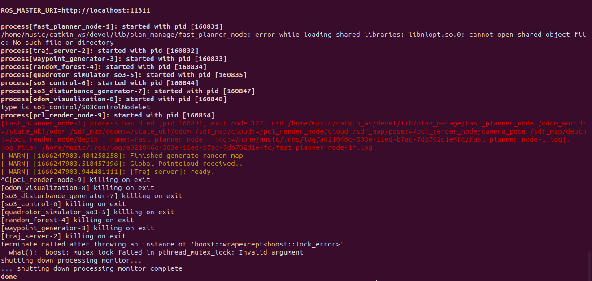

# 1、安装nlopt

如果是ubuntu16.04或者ubuntu18.04可以直接从sudo apt install ros-noetic-nlopt安装。

但是ubuntu20.04二进制安装会报错用不了（即使编译通过，运行时点击2D nav goal的时候也会报错）

 

所以源码编译安装：

    sudo apt install libarmadillo-dev //安装线性库
    
    git clone https://github.com/stevengj/nlopt.git//非线性优化库安装
    cd nlopt
    mkdir build && cd build
    cmake ..
    make
    sudo make install


# 2、建立工作空间并下载fast-planner

    mkdir -p competition_ws/src
    cd competition_ws/src
    catkin_init_workspace
    git clone https://github.com/HKUST-Aerial-Robotics/Fast-Planner.git

# 3、修改源码

## 3.1 修改cmakelist

如果遇到pcl的报错，就是这个问题
主要是PCL库的C++支持，将所有的功能包的

    set(CMAKE_CXX_FLAGS "-std=c++11 ${CMAKE_CXX_FLAGS} -O3 -Wall")

改为

    set(CMAKE_CXX_FLAGS "-std=c++14 ${CMAKE_CXX_FLAGS} -O3 -Wall")

（其实有一些是不用改的，但是全改了也无妨）

## 3.2 修改world坐标系名称

到/Fast-Planner/uav_simulator/Utils/odom_visualization/src/odom_visualization.cpp中把"/world"前面的/去掉，ubuntu20.04对/敏感

## 3.3 修改函数返回值

### (1)

到Fast-Planner/fast_planner/plan_env/include/edt_environment.h，将下面的两个函数的返回值改为void

    pair<double, Eigen::Vector3d> interpolateTrilinear()

    pair<double, Eigen::Vector3d> evaluateEDTWithGrad()

改为

    void interpolateTrilinear(double values[2][2][2], const Eigen::Vector3d& diff,
                                                        double& value, Eigen::Vector3d& grad);
    void evaluateEDTWithGrad(const Eigen::Vector3d& pos, double time,
                                                        double& dist, Eigen::Vector3d& grad);

### (2)

同时，将edt_environment.cpp也做对应的修改

### (3)

到/Fast-Planner/fast_planner/path_searching/src/kinodynamic_astar.cpp里搜KinodynamicAstar::timeToIndex函数，可以看到函数返回值是int，但是函数体没有return。

增加一个return，修改如下：

```c++
    int KinodynamicAstar::timeToIndex(double time)
    {
        int idx = floor((time - time_origin_) * inv_time_resolution_);
        return idx;
    }
```
