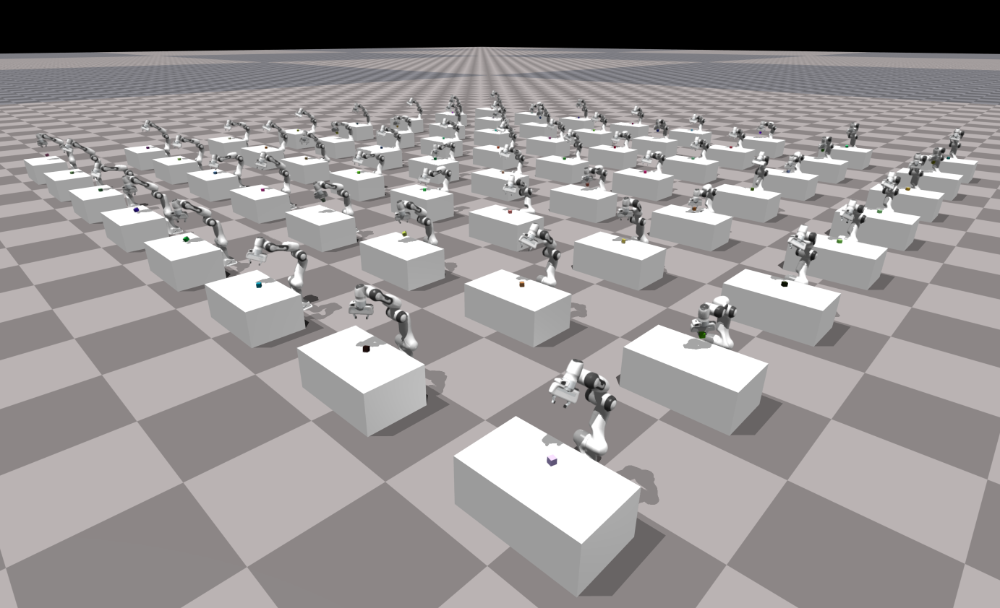
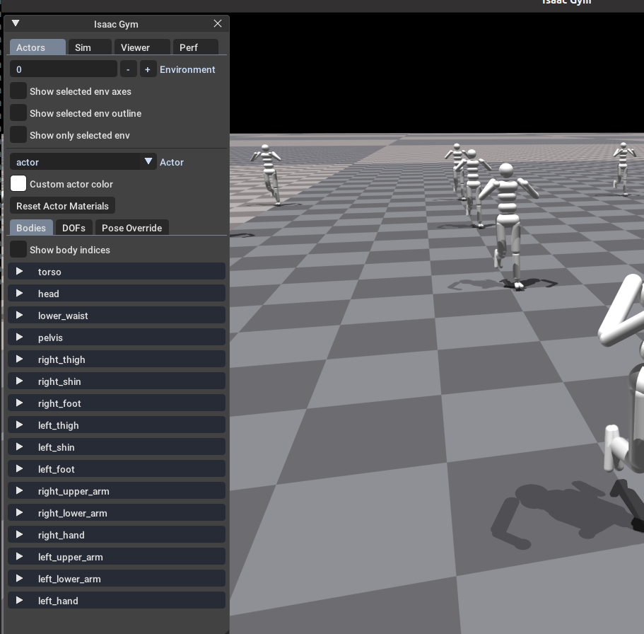
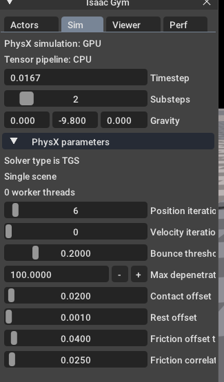
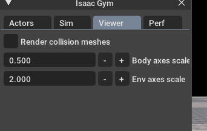

# 1、Simulation Setup

Isaac Gym提供了一个仿真的接口，让您可以创建用于训练智能体的动态环境。API是面向过程和数据的，而不是面向对象的。这有助于在用C++编写的核心实现和用Python编写的客户端脚本之间高效地交换信息。例如，Isaac Gym不使用身体和关节对象的层次集合，而是使用平面数据阵列来表示模拟的状态和控制。这使得使用常见的Python库（如NumPy）处理数据变得容易，NumPy提供了操作多维数组的有效方法。还可以访问作为CPU或GPU张量的模拟数据，这些张量可以与PyTorch等常见的深度学习框架共享。

 核心API，包括支持的数据类型和常量，在gymapi模块中定义： 

 ```python
    from isaacgym import gymapi
 ```

所有Gym API函数都可以作为启动时获取的单个Gym对象的方法访问：


 ```python
    gym = gymapi.acquire_gym()
```
在程序开始时，通过`gym = gymapi.acquire_gym()`创建gym对象，后续所有的API函数都可以使用`gym.xxx()`的方式调用

gym对象本身作用不大，它仅仅是作为Gym API的代理(proxy)


# 2、创建仿真Creating a Simulation

## 2.1 create_sim

上面创建的gym对象本身作用不大，它仅仅是作为Gym API的代理(proxy)。要创建仿真，首先需要配置参数，然后调用create_sim方法，该方法返回一个对象： 

 ```python
    # 得到默认参数，该参数内容需要自行重写
    sim_params = gymapi.SimParams()
    # 创建仿真
    sim = gym.create_sim(compute_device_id, graphics_device_id, gymapi.SIM_PHYSX, sim_params)
 ```

sim对象包含物理和图形上下文(**contex**)，这些上下文将允许您加载资源、创建环境以及与仿真交互。


***compute_device_id***：计算设备序号，它为物理仿真使用的GPU设备。

***graphics_device_id***：图形设备序号，渲染使用的GPU。

在多GPU系统中，可以使用不同的设备来执行这些角色。

对于不需要任何传感器渲染的无头(headless)仿真（没有viewer），可以将图形设备设置为-1，并且不会创建任何图形上下文。

***第三个参数***：指定要使用的物理后端（物理引擎）。目前，选择有SIM_PHYSX或SIM_FLEX。

* PhysX后端提供了强大的刚体和关节模拟，可以在CPU或GPU上运行。它是目前唯一一个完全支持新张量API的后端。
* Flex后端提供完全在GPU上运行的柔体和刚体模拟，但它还不完全支持张量API。 

***最后一个参数***包含其他模拟参数，如下所述:

## 2.2仿真参数 gymapi.SimParams()

仿真参数允许您配置物理仿真的详细信息。根据物理引擎和要模拟的任务的特性，设置可能会有所不同。选择正确的参数对于模拟的稳定性和性能非常重要。下面的片段显示了物理参数的示例：

```python
    # get default set of parameters 获取默认参数
    sim_params = gymapi.SimParams()

    # set common parameters设置通用参数
    sim_params.dt = 1 / 60 # 仿真环境中的时间流逝速度
    sim_params.substeps = 2
    sim_params.up_axis = gymapi.UP_AXIS_Z
    sim_params.gravity = gymapi.Vec3(0.0, 0.0, -9.8)

    # set PhysX-specific parameters设置适用于PhysX引擎的参数
    sim_params.physx.use_gpu = True
    sim_params.physx.solver_type = 1
    sim_params.physx.num_position_iterations = 6
    sim_params.physx.num_velocity_iterations = 1
    sim_params.physx.contact_offset = 0.01
    sim_params.physx.rest_offset = 0.0

    # set Flex-specific parameters设置适用于Flex引擎的参数
    sim_params.flex.solver_type = 5
    sim_params.flex.num_outer_iterations = 4
    sim_params.flex.num_inner_iterations = 20
    sim_params.flex.relaxation = 0.8
    sim_params.flex.warm_start = 0.5

    # create sim with these parameters 使用这些参数创建仿真
    sim = gym.create_sim(compute_device_id, graphics_device_id, physics_engine, sim_params)
```

有些参数与物理引擎无关，如模拟速率、朝上的轴是哪一个、重力。其他仅适用于特定的物理引擎（分组在.physx和.flex下）。如果模拟仅使用特定的物理引擎运行，则无需为另一个引擎指定参数。

也可以为两个引擎都设置参数，这将允许在运行代码时轻松地切换引擎，例如基于命令行参数。 

**更多信息可以参阅文档：**

### 2.2.1 Up Axis 规定朝上的轴是哪一个

Isaac Gym同时支持y-up和z-up。尽管z-up在机器人和研究社区中更常见，但由于遗留原因，Gym默认为y-up。

这在未来可能会改变，但与此同时，创建z-up模拟并不困难。最重要的是在创建模拟时在SimParams中配置向上轴和重力：

    sim_params.up_axis = gymapi.UP_AXIS_Z
    sim_params.gravity = gymapi.Vec3(0.0, 0.0, -9.8)

另一个需要特别注意z向上选择的地方是在创建地平面时，如下所述:

## 2.3 创建地面 Creating a Ground Plane

大多数模拟都需要一个地平面，除非它们是在零重力条件下进行的。可以这样配置和创建地平面：

```python
    # configure the ground plane
    plane_params = gymapi.PlaneParams() # 获取
    plane_params.normal = gymapi.Vec3(0, 0, 1) # z-up!
    plane_params.distance = 0
    plane_params.static_friction = 1
    plane_params.dynamic_friction = 1
    plane_params.restitution = 0

    # create the ground plane
    gym.add_ground(sim, plane_params)
```
`plane_params.normal` :法线，定义平面方向，并取决于上轴的选择。z-up时，法线应该就是z轴，应为（0，0，1），同理使用（0、1，0）表示y-up。当然也可以指定不和某个坐标轴对齐的法向量，以获得倾斜的地平面。

`distance` 距离，定义了平面到原点的距离。

`static_friction，dynamic_friction`：静摩擦和动摩擦是静态和动态摩擦的系数。

`restitution`：恢复系数可用于控制与地平面碰撞的弹性（反弹量）。


## 加载模型(资产) Loading Assets

Gym目前支持加载URDF和MJCF文件格式。加载资产文件将创建一个GymAsset对象，该对象包括所有实体、碰撞形状、视觉附件、关节和自由度（DOF）的定义。某些格式也支持柔体和粒子。


加载资源时，需要指定资产根目录和相对于根的资源路径。这种拆分是必要的，因为导入器有时需要在资产目录树中搜索外部参照文件，如网格或材质。资产根目录可以指定为绝对路径，也可以指定为相对于当前工作目录的路径。在Python示例中，我们加载的资产如下所示：
```python
    asset_root = "../../assets" # 储存资产的根目录
    asset_file = "urdf/franka_description/robots/franka_panda.urdf" # 相对于根的路径
    asset = gym.load_asset(sim, asset_root, asset_file)
```

load_asset方法使用文件扩展名来确定资产文件格式。支持的扩展名包括urdf文件的.udf和MJCF文件使用的.xml。

有时，您可能希望将额外信息传递给资产加载器(asset importer)。这是通过指定一个可选的AssetOptions参数来实现的：

```python
    asset_options = gymapi.AssetOptions()
    asset_options.fix_base_link = True
    asset_options.armature = 0.01

    asset = gym.load_asset(sim, asset_root, asset_file, asset_options)
```

导入选项会影响模型的物理和视觉特性，因此可能会影响模拟的稳定性和性能。更多详细信息请参见资产章节。

注意，加载资产不会自动将其添加到仿真环境中。GymAsset是actor的蓝图，可以在具有不同位姿和个性化属性的模拟中多次实例化。 

也就是说，`asset = gym.load_asset`仅仅是加载了模型，并未实例化，因为后续我们要进行并行的仿真，要以此为模板，实例化很多很多的该asset，每一个可能有不同的初始化参数。


# 3、创建并行的Environments为每个环境塞进Actor



这张是examples/franka_cube_ik.py的截图，其中使用PhysX在GPU上模拟了64个环境Environments。
每个环境都有三个Actors：一只弗兰卡手臂、一张桌子和一个要捡的盒子。
这些环境在物理上彼此**独立**，但为了便于监控而一起呈现。
通过PyTorch使用基于张量的API来获取所有env的状态并应用控件。 


一个环境由一组Actors和sensors组成，这些Actors和传感器一起被模拟。环境中的Actors在物理上相互作用。它们的状态由物理引擎维持，并且可以使用稍后讨论的控制API进行控制。放置在环境中的传感器，如相机，将能够捕捉到该环境中的actor。

Isaac Gym的一个重要设计方面是能够将环境的多个实例打包到单个模拟中。这在强化学习等应用领域很重要，因为在强化学习中需要大量的运行来训练智能体(agent)执行某些任务。使用Isaac Gym，您可以同步运行数十个、数百个甚至数千个环境实例。您可以随机化每个环境中的初始条件，如布局、actor位姿，甚至actor本身。您可以随机化所有actor的物理、视觉和控制属性。

将多个环境打包到一个仿真中有几个优点，但总体原因是性能。许多场景实际上都很简单。你可能有一个人形模型学习在平地上行走，或者有一个关节式机械臂学习在橱柜里捡东西。运行仿真的每个时间步骤都会涉及一定的开销。通过将多个简单的环境打包到一个模拟中，我们最大限度地减少了开销，并提高了整体计算密度。这意味着，与启动计算和收集结果所需的设置时间相比，需要在进行有意义的计算上花费更多的时间。

Isaac Gym提供了一个简单的过程API，用于创建环境并用actor填充环境。这比从文件中直接加载静态场景更有用，因为它允许您在将所有actor添加到场景中时控制他们的位置和属性。

在添加actor之前，必须创建一个环境：

```python
    spacing = 2.0 #空间大小参数
    # 空间立方体的对角两个点
    lower = gymapi.Vec3(-spacing, 0.0, -spacing)
    upper = gymapi.Vec3(spacing, spacing, spacing)
    # 创建环境
    env = gym.create_env(sim, lower, upper, 8)
```
每个env都有自己的坐标空间，这些坐标空间嵌入到全局模拟空间中。

创建环境时，我们指定环境的局部范围，这取决于环境实例之间所需的间距。

随着新环境被添加到模拟中，它们将一次一行地排列在2D网格中。create_env的最后一个参数说明每行有多少个env。

actor只是GymAsset的一个实例。若要将actor添加到环境中，必须指定源属性、所需位置和其他一些细节：

```python
pose = gymapi.Transform()
pose.p = gymapi.Vec3(0.0, 1.0, 0.0)
pose.r = gymapi.Quat(-0.707107, 0.0, 0.0, 0.707107)

actor_handle = gym.create_actor(env, asset, pose, "MyActor", 0, 1)
```
每个actor都必须被放置在一个环境中。不能有不属于任何环境的actor。

actor位姿是使用位置向量p和方向四元数r在env局部坐标中定义的。在上面的片段中，方向由四元数（-0.707107，0.0，0.0，0.707107）指定。Quat构造函数按（x，y，z，w）顺序接受参数，因此此四元数表示绕x轴旋转-90度。将使用z-up约定定义的资产加载到使用y-up约定的仿真中时，这种旋转是必要的。

Isaac Gym提供了一个方便的数学助手集合，包括四元数实用程序，因此四元数可以定义为轴角形式，如下所示：

```python
    pose.r = gymapi.Quat.from_axis_angle(gymapi.Vec3(1, 0, 0), -0.5 * math.pi)
```
有关数学实用程序的更多信息，请参阅Math Utilities

pose后面的create_actor参数是可选的。可以为actor指定一个名称，在本例中为“MyActor”。这样以后就可以按actor的名字查找了。如果要这样用名字索引actor，必须确保在同一环境中为所有参与者分配唯一的名称，这是因为名称是可选的，所以Isaac Gym不强制要求唯一性。也可以保存create_actor返回的actor句柄，而不是按名称查找actor，这个句柄唯一地标识环境中的参与者，并避免了以后搜索它的计算成本。

参数列表末尾的两个整数是`collision_group`和`collision_filter`。这些数值在行动者的物理模拟中起着重要作用。

`collision_group`是一个整数，用于标识actor的身体将被分配到的碰撞组。只有当两个物体属于同一碰撞组时，它们才会相互碰撞。每个环境通常有一个碰撞组，在这种情况下，可以设置组的id为环境索引数i。这就阻止了不同环境中的参与者之间进行物理交互。在某些情况下，您可能希望为一个环境设置多个碰撞组，以实现更细粒度的控制。值-1用于与所有其他组碰撞的特殊碰撞组。这可以用于创建“共享”对象，这些对象可以与所有环境中的actor进行物理交互。

`collision_filter`是一个bit mask掩码，可以过滤出物体之间的碰撞。如果两个实体的碰撞过滤器有一个公共位集，那么它们就不会碰撞。该值可用于过滤多体演员中的自碰撞，或防止场景中某些类型的对象进行物理交互。

设置仿真时，可以在一个循环中初始化所有环境： 

```python
# set up the env grid
num_envs = 64
envs_per_row = 8
env_spacing = 2.0
env_lower = gymapi.Vec3(-env_spacing, 0.0, -env_spacing)
env_upper = gymapi.Vec3(env_spacing, env_spacing, env_spacing)

# cache some common handles for later use
envs = []
actor_handles = []

# create and populate the environments
for i in range(num_envs):
    env = gym.create_env(sim, env_lower, env_upper, envs_per_row)
    envs.append(env) #储存所有的环境句柄

    height = random.uniform(1.0, 2.5)

    pose = gymapi.Transform()
    pose.p = gymapi.Vec3(0.0, height, 0.0)

    actor_handle = gym.create_actor(env, asset, pose, "MyActor", i, 1) #实例化一个actor，并且塞到指定的环境中
    actor_handles.append(actor_handle) #储存所有的actor句柄
```
在上面的代码中，所有env都包含相同类型的actor，但actor以随机的高度生成。请注意，分配给每个actor的冲突组对应于环境索引，这表示来自不同环境的actor不会在物理上相互交互。在构建环境时，我们还将一些有用的信息(比如env和actor句柄)缓存在列表中，以便在后续代码中轻松访问。

目前，用于设置环境的过程API有一些限制。假设所有环境都是按顺序创建和填充（populated殖民）。您创建一个环境并将所有actor添加到其中，然后创建另一个环境，并将其所有参与者添加到此环境中，依此类推。一旦您完成一个环境的填充并开始填充下一个环境后，就无法再将actor添加到上一个环境中。这与如何在内部组织数据以促进状态缓存的高效批量索引方案有关。这一限制在未来可能会被取消，但现在要意识到这些限制。这意味着在完成环境设置后，不能在环境中添加或删除actor。也就是说，不能在任意时刻为环境动态地添加actor。

有一些方法可以“假装”在一个环境中拥有动态数量的actor，这将在另一节中讨论。

# 4、运行仿真Running the Simulation

设置环境栅格和其他参数后，可以开始仿真。这通常在循环中完成，其中循环的每次迭代对应于一个时间步长： 

```python
while True:
    # step the physics
    gym.simulate(sim)
    gym.fetch_results(sim, True)
```

Isaac Gym提供了多种查询世界状态和应用控件的方法。您还可以收集传感器快照并与外部学习框架连接。这些主题将在随后的章节中讨论。

# 添加viewer可视化界面

默认情况下，仿真不会创建任何视觉反馈窗口。
这允许仿真在没有连接监视器的工作站或集群上运行。然而，在开发和测试时，能够可视化仿真是很有用的。Isaac Gym配备了一个简单的集成查看器viewer，可以让您看到仿真中发生的事情。

创建一个viewer：
```python
cam_props = gymapi.CameraProperties()
viewer = gym.create_viewer(sim, cam_props)
```
这将弹出一个具有默认尺寸的窗口。您可以通过自定义参数`isaacgym.gymapi.CameraProperties`来设置不同的尺寸。

为了更新查看器，需要在仿真循环的每次迭代过程中执行以下代码： 

```python
    gym.step_graphics(sim)
    gym.draw_viewer(viewer, sim, True)
```
step_graphics方法将仿真的视觉描述与物理状态同步。
draw_viewer方法在查看器中渲染最新的快照。

它们是单独的方法，因为即使在没有viewer的情况下也可以使用step_graphics，比如在渲染相机传感器时。

使用此代码，查看器窗口将尽快刷新(循环每次运行到这里的时候就会刷新)。对于简单的模拟，这通常会比真实的时间更快，因为每个dt(参数里面定义的)增量的推进速度都会比经过的实时时间流逝得更快。要按照真实时间同步视觉更新频率，可以在循环迭代结束时添加以下语句：
```
gym.sync_frame_time(sim)
```

这将使viewer更新的速率降至实时。如果仿真运行速度慢于实时，则此语句将无效。（注意只是把渲染的速度减慢到和真实环境一致，不改仿真环境的时间流速。）

如果希望在查看器窗口关闭时终止模拟，则可以在query_viewer_has_closed方法上设置循环条件，该方法将在用户关闭窗口后返回True。 

 包含查看器的基本仿真循环如下所示： 
```python
    while not gym.query_viewer_has_closed(viewer):

        # step the physics
        gym.simulate(sim)
        gym.fetch_results(sim, True)

        # update the viewer
        gym.step_graphics(sim)
        gym.draw_viewer(viewer, sim, True)

        # Wait for dt to elapse in real time.
        # This synchronizes the physics simulation with the rendering rate.
        gym.sync_frame_time(sim)
```

# 5、可视化窗口The Viewer GUI

创建viewer后，屏幕左侧将显示一个简单的图形用户界面。GUI的显示可以通过“Tab”键进行切换。

GUI有4个独立的选项卡：Actors、Sim、Viewer和Perf。


* “Actors”选项卡提供了选择环境和该环境中的Actor的功能。对于当前选定的Actor，有三个单独的子选项卡。




    “实体Bodies”子选项卡提供有关活动Actor的刚体的信息。它还允许更改演员身体的显示颜色并切换身体轴的可视化。

    “自由度DOFs ”子选项卡显示有关活动Actor的自由度的信息。自由度属性可以使用用户界面进行编辑，请注意，这是一个实验特性。

    “位姿覆盖Pose Override”子选项卡可用于使用Actor的自由度手动设置演员的姿势。启用此功能后，将使用滑块在用户界面中设置的值覆盖选定Actor的姿势和驱动目标。它可以是一个有用的工具，用于交互式地探索或操纵Actor的自由度。


* Sim选项卡显示物理模拟参数。参数因仿真类型（PhysX或Flex）而异，用户可以对其进行修改。



* Viewer选项卡允许自定义常见的可视化选项。一个值得注意的功能是能够在查看身体的图形表示和物理引擎使用的物理形状之间切换。这在调试物理行为时很有帮助。



* Perf选项卡显示gym内部测量到的性能。顶部滑块“性能测量窗口”指定用于测量性能的帧数。帧速率报告先前测量窗口上的平均每秒帧数（FPS）。其余性能度量报告为指定帧数内每帧的平均值。


    Frame Time 帧时间是从一步开始到下一步开始的总时间

    Physics simulation 物理模拟时间是物理解算器运行的时间。

    Physics Data Copy 物理数据复制是复制模拟结果所花费的时间。

    Viewer Rendering 空闲时间是指空闲的时间（待机挂起），通常在sync_frame_time（sim）之内。

    Sensor Image Copy 查看器渲染时间是渲染和显示查看器所花费的时间

    Sensor Image Copy time 传感器图像复制时间是将传感器图像数据从GPU复制到CPU所花费的时间。

    Sensor Image Rendering time 传感器图像渲染时间是将相机传感器（不包括查看器相机）渲染到GPU缓冲区中所花费的时间。

# 6、Custom Mouse/Keyboard Input

要从查看器获取鼠标/键盘输入，可以订阅和查询动作事件。

有关如何做到这一点的示例，请查看examples/projectiles.py： 
```python
gym.subscribe_viewer_keyboard_event(viewer, gymapi.KEY_SPACE, "space_shoot")
gym.subscribe_viewer_keyboard_event(viewer, gymapi.KEY_R, "reset")
gym.subscribe_viewer_mouse_event(viewer, gymapi.MOUSE_LEFT_BUTTON, "mouse_shoot")
...
while not gym.query_viewer_has_closed(viewer):
    ...
    for evt in gym.query_viewer_action_events(viewer):
        ...
```

# 7、Cleanup
在退出时，应按如下方式释放sim和Viewer对象：

```python
gym.destroy_viewer(viewer)
gym.destroy_sim(sim)
```

# 总结：

整体流程：

1、首先搞一个gym = gymapi.acquire_gym()用来方便得使用API

2、设置仿真参数，创建仿真sim = gym.create_sim

3、加载读入模型

4、设置环境参数，创建环境1，实例化actor塞进去，然后创建环境2，塞进去actor,循环

5、开始仿真循环：执行一步step，更新viewer刷新渲染，同步viewer帧为真实时间（可选）

6、结束，销毁仿真和viewer