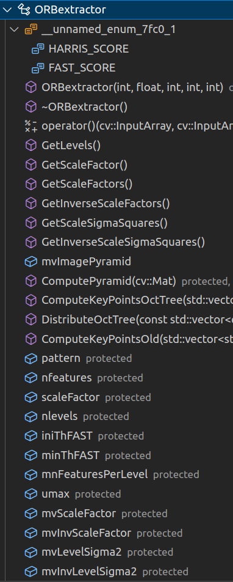
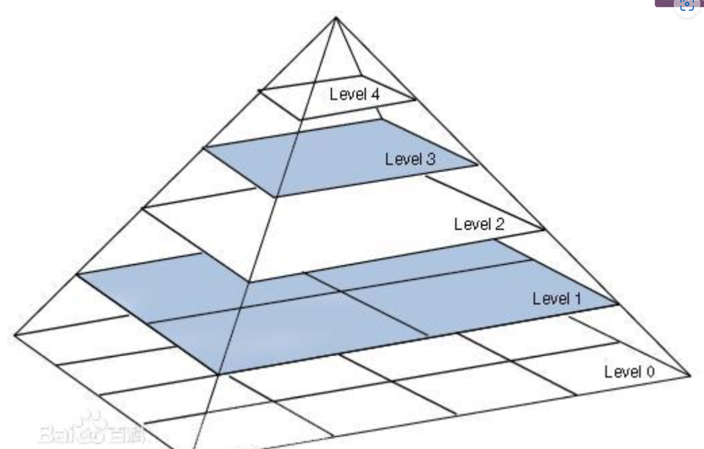

# ORBextractor类成员变量和成员函数


# 构造函数

## 1、配置图像金字塔参数



主要是

## umax的计算

为什么要提前算好一个umax？

为了方便后面用灰度质心法计算旋转。灰度质心法计算的区域是个圆，那么就要知道圆里面有那些像素。但是像素是方块，为了避免舍入造成的不对称问题，就计算了一个umax

```c++
    umax.resize(HALF_PATCH_SIZE + 1);
	
	//cvFloor返回不大于参数的最大整数值，cvCeil返回不小于参数的最小整数值，cvRound则是四舍五入
    int v,		//循环辅助变量
		v0,		//辅助变量
		vmax = cvFloor(HALF_PATCH_SIZE * sqrt(2.f) / 2 + 1);	//计算圆的最大行号，+1应该是把中间行也给考虑进去了
				//NOTICE 注意这里的最大行号指的是计算的时候的最大行号，此行的和圆的角点在45°圆心角的一边上，之所以这样选择
				//是因为圆周上的对称特性
				
	//这里的二分之根2就是对应那个45°圆心角
    
    int vmin = cvCeil(HALF_PATCH_SIZE * sqrt(2.f) / 2);
	//半径的平方
    const double hp2 = HALF_PATCH_SIZE*HALF_PATCH_SIZE;

	//利用圆的方程计算每行像素的u坐标边界（max）
    for (v = 0; v <= vmax; ++v)
        umax[v] = cvRound(sqrt(hp2 - v * v));		//结果都是大于0的结果，表示x坐标在这一行的边界

    // Make sure we are symmetric
	//这里其实是使用了对称的方式计算上四分之一的圆周上的umax，目的也是为了保持严格的对称（如果按照常规的想法做，由于cvRound就会很容易出现不对称的情况，
	//同时这些随机采样的特征点集也不能够满足旋转之后的采样不变性了）
	for (v = HALF_PATCH_SIZE, v0 = 0; v >= vmin; --v)
    {
        while (umax[v0] == umax[v0 + 1])
            ++v0;
        umax[v] = v0;
        ++v0;
    }
```