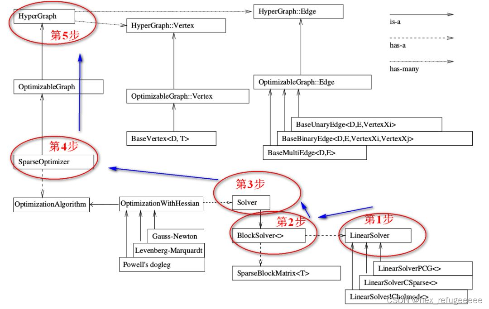

# What is G2O ?
General Graph Optimization
通用图优化

g2o的核里带有各种各样的求解器，而它的顶点、边的类型则多种多样。通过自定义顶点和边，事实上，只要一个优化问题能够表达成图，那么就可以用g2o去求解它。常见的，比如bundle adjustment，ICP，数据拟合，都可以用g2o来做。

# 文件构成

各文件夹的内容：

EXTERNAL　　三方库，有ceres, csparse, freeglut，可以选择性地编译；
cmake_modules　　给cmake用来寻找库的文件。我们用g2o时也会用它里头的东西，例如FindG2O.cmake
doc　　　　　文档。包括g2o自带的说明书（难度挺大的一个说明文档）。
g2o　　　　　　最重要的源代码都在这里！
script　　　　在android等其他系统编译用的脚本，由于我们在ubuntu下就没必要多讲了。

apps　　　　一些应用程序。好用的g2o_viewer就在这里。其他还有一些不常用的命令行工具等。
core　　　　核心组件，很重要！基本的顶点、边、图结构的定义，算法的定义，求解器接口的定义在这里。
examples　　一些例程，可以参照着这里的东西来写。不过注释不太多。
solvers　　　　求解器的实现。主要来自choldmod, csparse。在使用g2o时要先选择其中一种。
stuff　　　　对用户来讲可有可无的一些工具函数。
types　　　　各种顶点和边，很重要！我们用户在构建图优化问题时，先要想好自己的顶点和边是否已经提供了定义。如果没有，要自己实现。如果有，就用g2o提供的即可。
　　就经验而言，solvers给人的感觉是大同小异，而 types 的选取，则是 g2o 用户主要关心的内容。然后 core 下面的内容，我们要争取弄的比较熟悉，才能确保使用中出现错误可以正确地应对。

# 类的结构

先看上半部分。`SparseOptimizer` 是我们最终要维护的东东。它是一个`Optimizable Graph`，从而也是一个`Hyper Graph`。一个 `SparseOptimizer` 含有很多个顶点 （都继承自 `Base Vertex`）和很多个边（继承自 `BaseUnaryEdge`, `BaseBinaryEdge`或`BaseMultiEdge`）。这些 `Base Vertex` 和 `Base Edge` 都是抽象的基类，而实际用的顶点和边，都是它们的派生类。我们用`SparseOptimizer.addVertex` 和 `SparseOptimizer.addEdge` 向一个图中添加顶点和边，最后调用 `SparseOptimizer.optimize` 完成优化。

在优化之前，需要指定我们用的求解器和迭代算法。从图中下半部分可以看到，一个 `SparseOptimizer` 拥有一个 `Optimization Algorithm`,继承自`Gauss-Newton, Levernberg-Marquardt, Powell's dogleg` 三者之一（我们常用的是GN或LM）。同时，这个 `Optimization Algorithm` 拥有一个Solver，它含有两个部分:

一、 `SparseBlockMatrix`，用于计算稀疏的雅可比和海塞；

二、用于计算迭代过程中最关键的一步，求解方程：

$$ H \Delta x = -b $$

这就需要一个线性方程的求解器。而这个求解器，可以从 PCG, CSparse, Choldmod 三者选一。

综上所述，在g2o中选择优化方法一共需要三个步骤：

选择一个线性方程求解器，从 PCG, CSparse, Choldmod中选，实际则来自 g2o/solvers 文件夹中定义的内容。
选择一个 BlockSolver 。
选择一个迭代策略，从GN, LM, Doglog中选。

在前面的框架图中，介绍是从上到下的。在g2o的运行过程中是从下到上的。

整个流程是这样的：

* 第一步：先确定采用什么线性求解器。

* 第二步：使用第一步的线性求解器初始化BlockSlover<>。

* 第三步：从三个迭代方法中选择合适的并使用第二步获得的BlockSlover<>来初始化Solver。

* 第四步：创建核心SparseOptimizer.

* 第五步：定义顶点和边，然后添加到SparseOptimizer中去。

what is the physical meaning of  hessian matrix in Gauss Newton method?

In the Gauss-Newton method, the Hessian matrix represents the second-order partial derivatives of the error function with respect to the optimization variables. It provides information about the local curvature of the error function around the current estimate of the optimization variables.

The physical meaning of the Hessian matrix can be understood in the context of the optimization process and the objective of minimizing the error function. Here are a few key interpretations:

Curvature of the Error Surface: The Hessian matrix describes the curvature of the error surface around the current estimate of the optimization variables. Specifically, it provides information about how the error function changes as the optimization variables are perturbed. Positive eigenvalues of the Hessian indicate regions of convexity, where the error decreases as the variables move away from the current estimate. Negative eigenvalues indicate regions of concavity, where the error increases as the variables move away. The magnitude of the eigenvalues gives an indication of the curvature and steepness of the error surface.

Local Optimality: The Hessian matrix plays a crucial role in determining the local optimality of the current estimate. In the Gauss-Newton method, the algorithm iteratively updates the optimization variables by moving in the direction of steepest descent. The Hessian matrix is used to estimate the step size and direction for this update. If the Hessian is positive-definite, it implies that the current estimate is at a local minimum, as the error decreases in all directions. Conversely, if the Hessian has negative eigenvalues, it indicates a local maximum or saddle point.

Convergence and Stability: The properties of the Hessian matrix influence the convergence behavior and stability of the optimization process. A well-conditioned and positive-definite Hessian matrix can lead to faster convergence and robust optimization. Conversely, a poorly conditioned or near-singular Hessian can cause slow convergence, numerical instability, or convergence to suboptimal solutions.

Overall, the Hessian matrix in the Gauss-Newton method provides valuable insights into the local geometry of the error function and guides the optimization process towards a better estimate of the optimization variables.