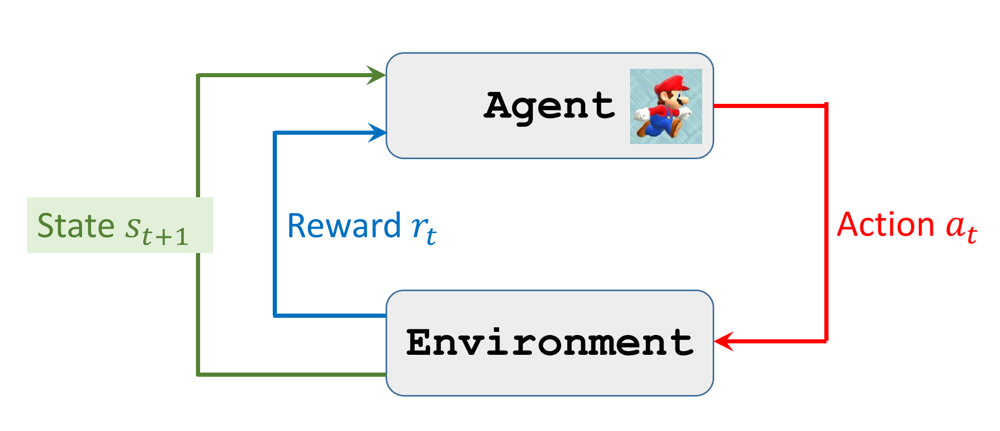
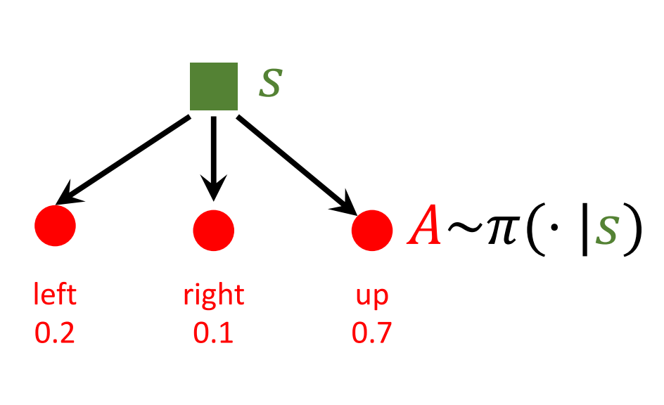
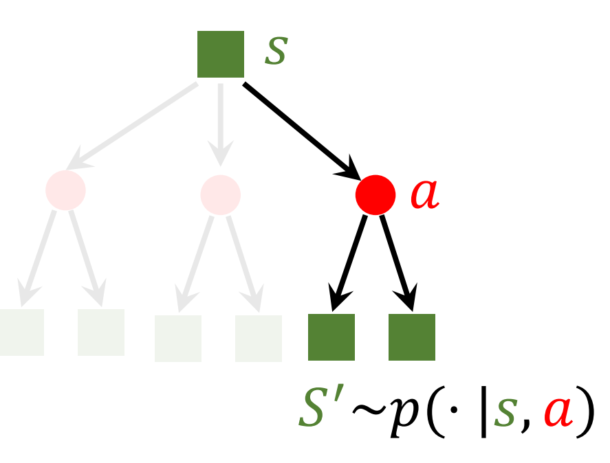
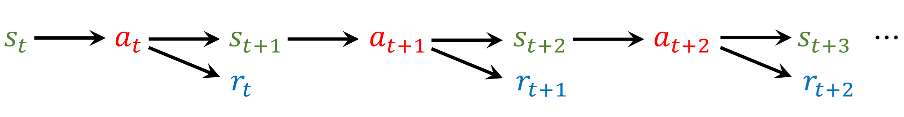

# 一、概率和符号约定

## 一些约定：

* 空心大写字母 $\mathbb{P}$ 表示概率
  
* 大写字母$X$表示随机变量
  
* 小写字母$x$表示观测值
  
* $p(x)$为概率密度函数
  
* 随机变量$X$的定义域为$\mathcal{X}$ 

$X=0$的概率表示为：

$$ \mathbb{P}(X=0)=0.5 $$

一维正态分布(标准高斯分布)：

$$ p(x)=\frac{1}{\sqrt{2 \pi \sigma^{2}}} \exp \left(-\frac{(x-\mu)^{2}}{2 \sigma^{2}}\right) $$

## 期望
* 连续分布
$$
\mathbb{E}[f(X)]=\int_X p(x) \cdot f(x)dx
$$

* 离散分布
$$\mathbb{E}[f(X)]=\sum_{x \in X} p(x) \cdot f(x)$$

# 二、强化学习基本概念

## 2.1 state action 
## 2.2 reward 
## 2.3 policy 

$$\pi(a \mid s)=\mathbb{P}(A=a \mid S=s)$$

## 2.4 state transition

$$ p\left(s^{\prime} \mid s, a\right)=\mathbb{P}\left(S^{\prime}=s^{\prime} \mid S=s, A=a\right)$$

## 2.5 随机性

* 1、动作的随机性
  给定环境$s$，策略$\pi(\cdot |s)$得到的每个动作的概率，最终选择哪个动作是按照概率抽样得到的

$$\pi(a \mid s)=\mathbb{P}(A=a \mid S=s)$$

* 2、状态转移的随机性
  在状态$S=s$的情况下采取动作$A=a$，下一个状态$S^{\prime}$也是个概率分布

$$ p\left(s^{\prime} \mid s, a\right)=\mathbb{P}\left(S^{\prime}=s^{\prime} \mid S=s, A=a\right)$$

***

## 2.6 return & Discounted return （回报&折扣回报）

* 回报：从$t$时刻开始，未来所有的奖励的总和

$$ U_t=R_t+R_{t+1}+R_{t+2}+R_{t+3}+\cdots $$

* 折扣回报：未来所有折扣奖励的总和，因为未来的奖励相比当前的显得不那么重要
  
  $$ U_t=R_t+\gamma R_{t+1}+\gamma ^{2} R_{t+2}+ \gamma ^{3} R_{t+3}+\cdots $$

  $\gamma$: discount rate(折扣率)

* 回报的随机性 Randomness in Returns

  随机性的两个来源：
  * 1、动作是随机的：$\mathbb{P}(A=a \mid S=s)=\pi(a \mid s)$
  * 2、新的状态（状态转移）是随机的： $\mathbb{P}\left(S^{\prime}=s^{\prime} \mid S=s, A=a\right)=p\left(s^{\prime} \mid s, a\right)$
  
  每一个奖励$R_i$的值都依赖于随机变量$S_i$和$A_i$。所以给定当前的状态的观测$s_i$，回报$U_t$依赖于1和2所述的一系列的随机变量 $A_t,A_{t+1},A_{t+2},\cdots$和$S_{t+1},S_{t+2},\cdots$
  
***

## 2.7 动作价值函数Action-Value Function $Q(s,a)$

先说定义：动作价值函数是折扣回报的期望.

折扣回报$U_t$是随机变量 $A_t,A_{t+1},A_{t+2},\cdots$和$S_{t+1},S_{t+2},\cdots$的函数。

假如$t$时刻，观测到了环境state为$s_t$并且使用策略函数$\pi$采取了动作$a_t$,如何评价这个动作的好坏？——计算回报。

但是回报是随机的（见2.6）。

动作价值函数是折扣回报的期望，即$U_t$对$t$时刻之后所有的随机变量取期望，这样的到的期望就不含$A_{t+1},A_{t+2},\cdots$和$S_{t+1},S_{t+2},\cdots$

$$ Q_\pi\left(s_t, a_t\right)=\mathbb{E}\left[U_t \mid S_t=s_t, A_t=a_t\right] $$

* 含义：给定策略 $\pi$ , $Q_\pi\left(s, a\right)$评估了agent在状态$s$下采取动作$a$的好坏

***

## 2.8 Optimal action-value function最优动作价值函数

虽然给定了当前的观测$s_t$和动作$a_t$，但是策略函数$\pi()$影响着后续的所有$A_{t+1},A_{t+2},\cdots$和$S_{t+1},S_{t+2},\cdots$。

最优价值函数是$Q_\pi$对于所有的策略函数$\pi()$可能产生的结果取最大化

$$Q^{\star}\left(s_{t}, a_{t}\right)=\max _{\pi} Q_{\pi}\left(s_{t}, a_{t}\right)$$

***

## 2.9 State-value function 状态价值函数

考虑当前的状态$s_t$，怎样评估当前状态的好坏呢？

可以用动作价值函数的期望来评价：当前状态下，可能采取很多动作，通过策略$\pi$得到的动作是随机变量$A$，每个动作都会有动作价值，对于所有可能的动作取期望，就得到了状态价值函数。

$$V_{\pi}\left(s_{t}\right)=\mathbb{E}_{A}\left[Q_{\pi}\left(s_{t}, A\right)\right]$$

$$
\begin{aligned}
& V_\pi\left(s_t\right)=\mathbb{E}_A\left[Q_\pi\left(s_t, A\right)\right]=\sum_a \pi\left(a \mid s_t\right) \cdot Q_\pi\left(s_t, a\right) \\

& V_\pi\left(s_t\right)=\mathbb{E}_A\left[Q_\pi\left(s_t, A\right)\right]=\int_a \pi\left(a \mid s_t\right) \cdot Q_\pi\left(s_t, a\right) da
\end{aligned}
$$

* 怎样求期望（见（一））： 每一个动作价值*产生该动作的概率--->求和
* 含义：对于固定的策略$\pi$，$V_\pi(s)$评估了当前状态的好坏
* $\mathbb{E}_A\left[V_\pi\left(S\right)\right]$ 评估了策略$\pi$的好坏

# 三、agent与环境的交互过程

观测环境得到$s_t$，做出动作$a_t$，环境发生了变换，观测到环境变成了$s_{t+1}$,环境给出奖励$r_t$

动作的选择可以使用策略函数$\pi(a|s)$直接得到各个动作的分布，也可以使用$Q^{\star}(a,s)$，通过价值来判断选择哪个动作