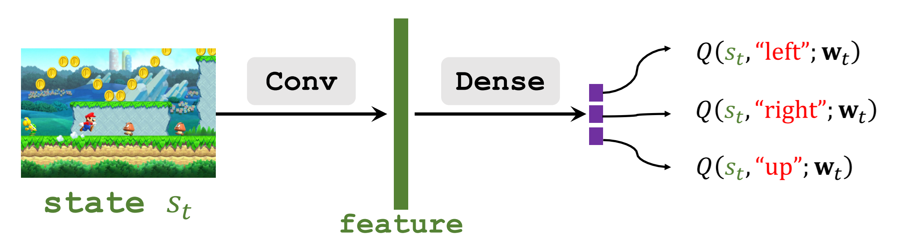
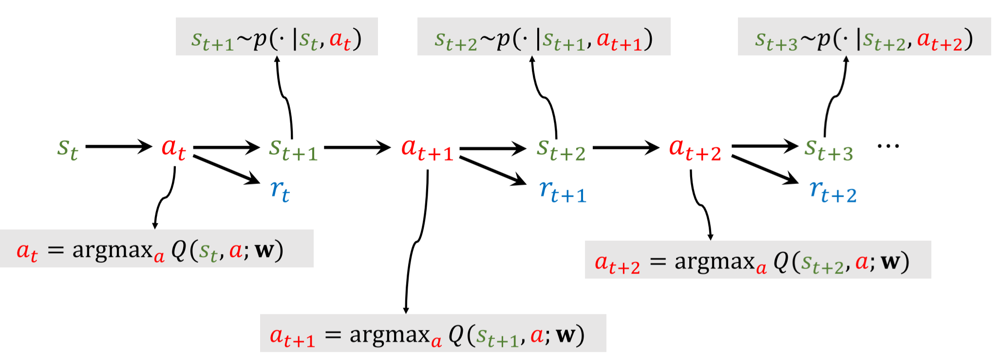
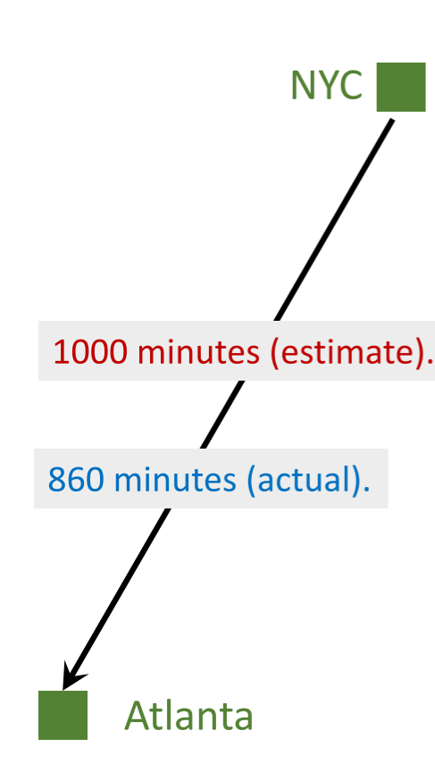
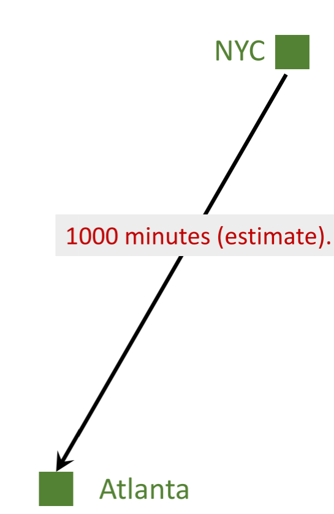
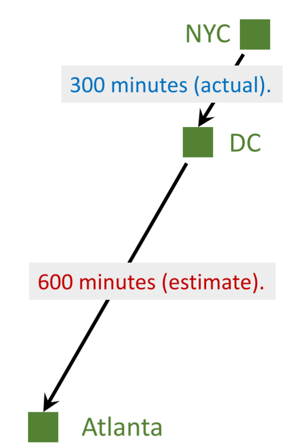
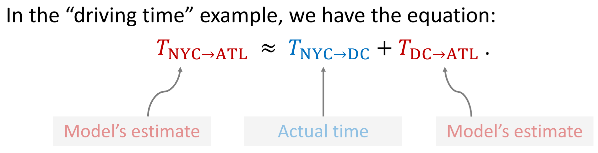
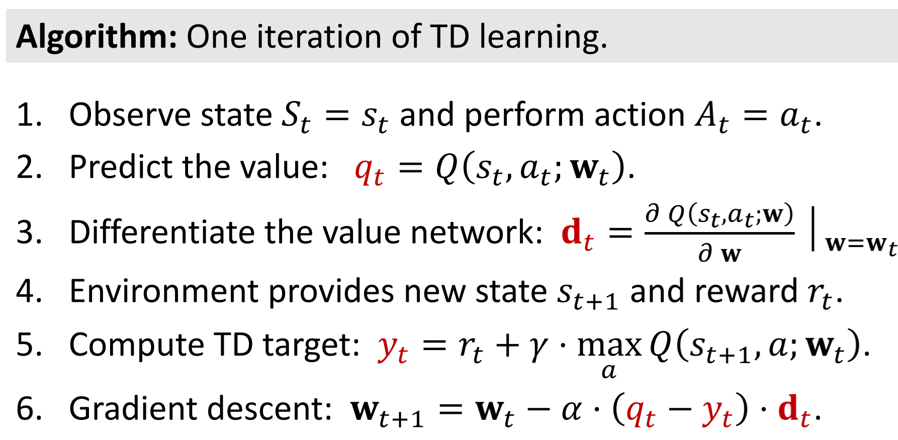

# Value-based learning

## 1、主要思想

* 使用神经网络$Q(s,a;\mathbf{w})$近似$Q^{\star}(s,a)$
* 观测到状态$s$，选择使得$Q^{\star}(s,a)$最大化的动作$a^{\star}$作为下一步的动作
  $$a^{\star} = \argmax _{a}Q^{\star}(s,a) $$

## 2、Deep QNetwork (DQN)

* 输入shape：图片的size
* 输出shape:动作空间的维度dimension of action space
  

## 3、交互过程

## 4、时序差分Temporal Difference (TD) Learning

## 例子：
* I want to drive from NYC to Atlanta.
* Model $𝑄(\mathbf{w})$ estimates the time cost, e.g., 1000 minutes.
* Question: How do I update the model?

### method 1 需要到达目的地

参数$\mathbf{w}$更新步骤：

* Make a prediction using$𝑄(\mathbf{w})$ : $𝑞 = 𝑄(\mathbf{w})$, e.g., $𝑞 = 1000$. 

* Finish the trip and get the target 𝑦, e.g., 𝑦 = 860.

* Get LOSS : $L=\frac{1}{2}(q-y)^{2}$

* Calculate Gradient：$\frac{\partial L}{\partial \mathbf{w}}=\frac{\partial q}{\partial \mathbf{w}} \cdot \frac{\partial L}{\partial q}=(q-y) \cdot \frac{\partial Q(\mathbf{w})}{\partial \mathbf{w}}$
* Gradient descent:$\mathbf{w}_{t+1}=\mathbf{w}_t-\left.\alpha \cdot \frac{\partial L}{\partial \mathbf{w}}\right|_{\mathbf{w}=\mathbf{w}_t}$

### method 2 不需要到达目的地，中途停下

* Can I update the model before finishing the trip?
* Can I get a better 𝐰 as soon as I arrived at DC?

参数$\mathbf{w}$更新步骤：

* Model’s estimate:   
   * NYC to Atlanta: 1000 minutes (**estimate**).
   * $𝑄(\mathbf{w})=1000$  minutes.
* I arrived at DC; 
  * actual time cost: NYC to DC: 300 minutes (**actual**).
* Model now updates its estimate:
  * DC to Atlanta: 600 minutes (**estimate**).
  * Updated estimate: 300 + 600 = 900 minutes.(TD target)
* TD target $y = 900$ is a more reliable estimate than 1000

* Loss: 
$$
L=\frac{1}{2}(\underbrace{Q(\mathbf{w})-y}_{TD \ \ error})^2
$$

* Gradient:
$$
\frac{\partial L}{\partial \mathbf{w}}=\underbrace{(1000-900)}_{TD \ \ error} \cdot \frac{\partial Q(\mathbf{w})}{\partial \mathbf{w}}
$$

* Gradient descent: 
$$
\mathbf{w}_{t+1}=\mathbf{w}_t-\left.\alpha \cdot \frac{\partial L}{\partial \mathbf{w}}\right|_{\mathbf{w}=\mathbf{w}_t}
$$

# 时序差分法在DQN中的应用

$$
Q\left(s_t, a_t ; \mathbf{w}\right) \approx r_t+\gamma \cdot Q\left(s_{t+1}, a_{t+1} ; \mathbf{w}\right)
$$

## 推导：

对于折扣回报$U_t$ 和 $U_{t+1}$有这样的关系：
$$
\begin{aligned}
U_t & =R_t+\gamma \cdot R_{t+1}+\gamma^2 \cdot R_{t+2}+\gamma^3 \cdot R_{t+3}+\gamma^4 \cdot R_{t+4}+\cdots \\
& =R_t+\gamma \cdot \underbrace{\left(R_{t+1}+\gamma \cdot R_{t+2}+\gamma^2 \cdot R_{t+3}+\gamma^3 \cdot R_{t+4}+\cdots\right)}_{=U_{t+1}}
\end{aligned}
$$
即：
$$ U_t = R_t +\gamma \cdot U_{t+1} $$

同时：
* DQN的输出$𝑄(𝑠_t,𝑎_t;\mathbf{w})$是对$U_t$的估计（期望）
* DQN的输出$𝑄(𝑠_{t+1},𝑎_{t+1};\mathbf{w})$是对$U_{t+1}$的估计（期望）

所以，等式两侧对$S_{t+1}$和$A_{t+1}$求期望可得：
$$
\underbrace{Q\left(s_t, a_t ; \mathbf{w}\right)}_{\text {estimate of } U_t} \approx \mathbb{E}_{S_{t+1},A_{t+1}}\left[R_t+\gamma \cdot \underbrace{Q\left(S_{t+1}, A_{t+1} ; \mathbf{w}\right)}_{\text {estimate of } U_{t+1}}\right]
$$

也就是：
$$
\underbrace{Q\left(s_t, a_t ; \mathbf{w}\right)}_{\text {Prediction}} \approx \underbrace{r_t+\gamma \cdot Q\left(s_{t+1}, a_{t+1} ; \mathbf{w}\right)}_{\text {TD target}}
$$

**!注意**  这里的推导不严谨，省略了一些步骤，详细见下一节 sarsa算法 TD学习

注意这里的约等于号，这说明等式两侧是不相等的。我们更相信TD target，因为相较于Prediction，TD target的计算利用了这一步实际的$r_t$，TD target更加接近真相。

Prediction:
$$Q\left(s_t, a_t ; \mathbf{w}\right)$$

## TD target 两种计算方式:
一种是用下一步实际的$Q$
$$
y_t = \underbrace{r_t+\gamma \cdot Q\left(s_{t+1}, a_{t+1} ; \mathbf{w}\right)}_{\text {TD target}}
$$
一种是用采取不同动作a可以得到的最大的$maxQ()$
$$
y_t = \underbrace{r_t+\gamma \cdot \max _{a} Q\left(s_{t+1}, a ; \mathbf{w}\right)}_{\text {TD target}}
$$

这两种其实分别对应了**on-policy**和**off-policy**策略

计算损失Loss:

$$L_t=\frac{1}{2}\left[Q\left(s_t, a_t ; \mathbf{w}\right)-y_t\right]^2$$

做梯度下降Gradient descent:

$$
\mathbf{w}_{t+1}=\mathbf{w}_t-\left.\alpha \cdot \frac{\partial L}{\partial \mathbf{w}}\right|_{\mathbf{w}=\mathbf{w}_t}
$$

# 总结

DQN使用神经网络$Q\left(s_t, a_t ; \mathbf{w}\right)$来近似**最优**价值函数$Q^{\star}(a,s)$

$$Q^{\star}\left(s_{t}, a_{t}\right)=\max _{\pi} Q_{\pi}\left(s_{t}, a_{t}\right)
=\max _{\pi}\mathbb{E}\left[U_t \mid S_t=s_t, A_t=a_t\right]
$$

$Q\left(s_t, a_t ; \mathbf{w}\right)$中$\mathbf{w}$是神经网络的参数

* 输入：环境的观测$s$
* 输出:所有动作$a\in\mathcal{A}$的评分

