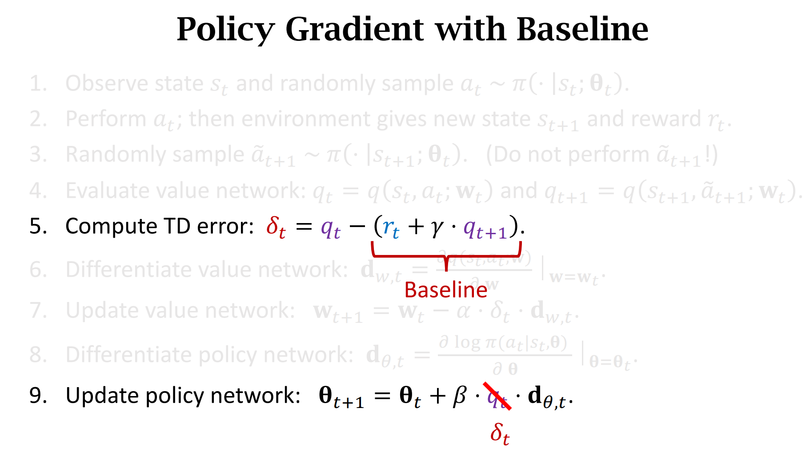

# 一、状态价值函数的近似

# 1.1 状态价值函数

$$V_\pi\left(s_t\right)=\sum_a \pi\left(a \mid s_t\right) \cdot Q_\pi\left(s_t, a\right)=\sum_a \pi\left(a \mid s_t ; \mathbf{ \theta }  \right) \cdot Q_\pi\left(s_t, a; \mathbf{w} \right)$$

* 其中$\pi$为策略网络，指导actor动作，$Q$为价值网络，评估动作好坏，给动作打分

# 1.2 Policy network 
* 策略网络(Actor)，用来控制agent运动
* 用神经网络$\pi\left(a \mid s_t ; \mathbf{ \theta }  \right)$近似策略函数$\pi\left(a \mid s_t\right)$
# 1.3 Value network
* Value networt 价值网络(Critic)，用来给动作打分
* 用神经网络$Q_\pi\left(s_t, a; \mathbf{w} \right)$近似价值函数$Q_\pi\left(s_t, a\right)$

# 二、网络训练过程

## 2.1 目的

更新参数$\theta$和$\mathbf{w}$，使神经网络更好地近似状态价值函数

## 2.2 训练
### 2.2.1 策略网络更新
* 更新策略网络$\pi(a \mid s_t ; \mathbf{ \theta })$使状态价值增大$V_\pi(s_t;\theta,\mathbf{w})$
* 监督信息完全来自于Critic网络的打分
* 状态价值增大，也就说明actor表现得越来越好，越来越会去挑选评分高的动作来执行
* 注意$\pi$是个概率密度函数，表现好的actor，$\pi$选择评分高的动作的概率也比较大。

### 2.2.2价值网络更新
* 更新价值网络$Q_\pi\left(s_t, a; \mathbf{w} \right)$使其更好的近似动作价值函数$Q$（评价动作的好坏，给动作打分）
* 评分会越来越准
* 监督信息完全来自于奖励(reward)，也就是环境给的评分

## 2.3 整体流程

# 三、价值网络更新

* 使用$\pi$随机抽样得到$a_t$和$a_{t+1}$，用价值网络给这两个动作打分，分别为$q(s_t,a_t;\mathbf{w}_t)$和$(s_{t+1},a_{t+1};\mathbf{w}_t)$
* 计算TD target：
$$
y_t = \underbrace{r_t+\gamma \cdot q (s_{t+1}, a_{t+1} ; \mathbf{w}_t)}_{\text {TD target}}
$$

* 计算损失：
$$L_t=\frac{1}{2}\left[q\left(s_t, a_t ; \mathbf{w}\right)-y_t\right]^2$$
* 梯度下降：
$$
\mathbf{w}_{t+1}=\mathbf{w}_t-\left.\alpha \cdot \frac{\partial L}{\partial \mathbf{w}}\right|_{\mathbf{w}=\mathbf{w}_t}
$$

降低损失，使得$y_t$越来越接近于$q\left(s_t, a_t ; \mathbf{w}\right)$

裁判打分越来越准确

# 四、策略网络更新

如何求策略梯度并且梯度上升，见上一章《策略学习》第五节

# 五、通俗化理解

* actor要去不断改进自己的动作，让自己的动作变好。但是actor本身不知道自己的动作好坏，所以需要一个裁判帮忙评价动作的好坏

* 裁判根据运动员做出的动作$a$和环境的状态$s$给动作打分，并且将得分$q$告诉actor

actor根据得分q、状态s和自己的动作a使用梯度上升更新参数，提高自己的能力，以获得更高的平均分。

注意：actor只是在一味地迎合Critic的喜好而已，actor只知道要让裁判的打分变高。更高的$q$不一定说明actor的水平变高了，只有好的裁判Critic才可以指导出好的运动员actor。所以这就需要改进裁判的打分能力（更新Critic网络）

* 刚开始时，价值网络是随机初始化的，打分全靠瞎猜

* 随着训练开始。Critic网络根据两次打分的$q$和奖励$r$使用TD算法更新参数
* 奖励r可以算是上帝给打的分数，是准确的

# 总结

* 注意：第7步中，我们按照动作函数$\pi$的概率密度抽样得到了一个动作$\tilde{a}_{t+1}$，这个动作并未执行，只是用来计算TD error

* $\mathbf{d}_{\theta,t}$和参数$\theta$的形状是一样的

* 第9步中$q_t \cdot \mathbf{d}_{\theta,t}$是策略梯度的蒙特卡洛近似

#  Policy Gradient with Baseline

第9步，梯度上升时，在论文和教科书以及实际应用时，往往用$\delta_t$代替$q_t$，称为"Policy Gradient with Baseline"，而使用$q_t$的称为标准算法。这都是可以的，两种策略梯度的期望完全相等。

但是实际使用时往往使用baseline，这是因为：虽然期望是一样的，但是好的baseline可以降低方差，加速训练收敛

任何接近$q_t$的都可以作为baseline，比如我们使用图中的TD target作为baseline，这样求出来的形式就是图中第九步的$\delta_t$

**************************
# 一个问题
???????

问题：更新价值网络的时候，可以使用off-policy策略吗？也就是使用
$$\delta_t= \max_{a} q \left(s_{t+1}, a ; \mathbf{w}_t\right)$$
