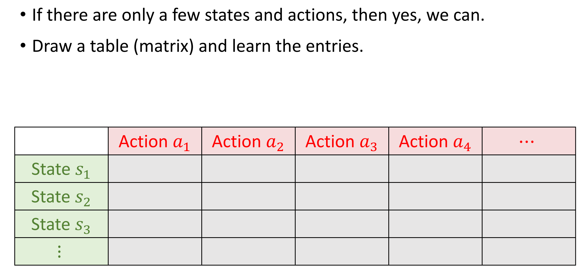
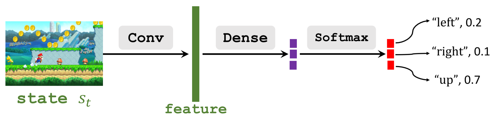
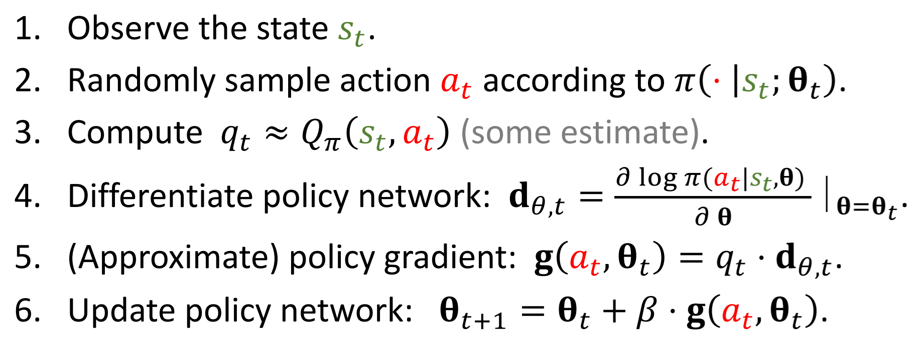

# 一、策略函数近似Policy Function Approximation

## 1.策略价值函数$\pi (a|s)$ 

$\pi (a|s)$ 是一个概率密度函数probability density function (PDF)

* 输入：状态$s$

* 输出：各个可能的动作被选择的概率probabilities for all the actions，例如：
  
$$\pi (left|s) = 0.2 $$
$$\pi (right|s) = 0.1 $$
$$\pi (up|s) = 0.7 $$

agent具体采取哪个动作是按照$\pi (a|s)$输出的概率分布抽样得到的。比如在状态$s$下，抽到动作left的概率为0.2。所有动作的概率之和为1

The agent performs an action 𝑎 random drawn from the distribution

***

## 2.动作离散且有限的情况

***

## 3.策略网络Policy Network $\pi(a|s;\theta)$

* 策略网络：用一个神经网络来近似策略函数$\pi (a|s)$
* 其中$\theta$是我们需要更新和优化的神经网络参数

网络输入输出如下如所示：

其中，softmax层保证了所有动作的概率之和为1

$$\sum_{a \in \mathcal{A}} \pi\left(\left.a\right|_s ; \boldsymbol{\theta}\right)=1$$

# 二、状态价值函数近似State-Value Function Approximation

## 1.状态价值函数$V_{\pi}\left(s_{t}\right)$ 和状态价值网络$V_\pi\left(s_t;\theta\right)$

状态价值函数：

$$V_{\pi}\left(s_{t}\right)=\mathbb{E}_{A}\left[Q_{\pi}\left(s_{t}, A\right)\right]$$

$$
\begin{aligned}
& V_\pi\left(s_t\right)=\mathbb{E}_A\left[Q_\pi\left(s_t, A\right)\right]=\sum_a \pi\left(a \mid s_t\right) \cdot Q_\pi\left(s_t, a\right) \\

& V_\pi\left(s_t\right)=\mathbb{E}_A\left[Q_\pi\left(s_t, A\right)\right]=\int_a \pi\left(a \mid s_t\right) \cdot Q_\pi\left(s_t, a\right) da
\end{aligned}
$$

* 含义：对于固定的策略$\pi$，$V_\pi(s)$评估了当前状态的好坏

使用神经网络来近似这个状态价值函数：

$V_\pi\left(s_t;\theta\right)=\mathbb{E}_A\left[Q_\pi\left(s_t, A\right)\right]=\sum_a \pi\left(a \mid s_t;\theta\right)\cdot Q_\pi\left(s_t, a\right)$

* 注意这里的 $\theta$ 是策略网络$\pi(s\mid a;\theta)$的 $\theta$
* 状态价值函数取决于$\pi$的好坏
* Policy-based learning的终极目标就是学一个最好的 $\theta$ (也就是学一个最好的$\pi(s\mid a;\theta)$函数)，使得对于所有可能的状态$s$，都有一个总体上最好的状态价值。
* 对于同样的情况，对于一个往往采取不好的策略的新手，可能是个死局。但是对于有非常好的策略的老手来说，可能转危为安。
* 我们的目的就在于学到这个更好的策略，使得所有的状态下，状态价值达到总体最优（对于所有状态的期望最大）。

*** 

## 2.策略学习Policy-based learning

策略学习的目标是优化参数$\boldsymbol \theta$最大化状态价值函数的期望$J(\boldsymbol{\theta})$

  $$J(\boldsymbol{\theta})=\mathbb{E}_S[V(S ; \boldsymbol{\theta})]$$

如何更新 $\theta$ ?------->  梯度上升Policy gradient ascent

步骤：

* 观察到状态$s$
* 更新策略函数的参数：$\boldsymbol{\theta} \leftarrow \boldsymbol{\theta}+\beta \cdot \frac{\partial V(s ; \boldsymbol{\theta})}{\partial \boldsymbol{\theta}}$

让我们捋一捋这个逻辑：

我们最终的目标要得到的是最好的$\pi(s \mid a ; \boldsymbol \theta)$，它是$\boldsymbol \theta$的函数，

$\pi(s \mid a ; \boldsymbol \theta)$好不好的评价标准是$J(\boldsymbol{\theta})$大不大，

因为$J(\boldsymbol{\theta})$是$V_\pi\left(s_t;\theta\right)$的期望，而$V_\pi\left(s_t;\theta\right)$是与$\pi(s \mid a ; \boldsymbol \theta)$有关的，$J(\boldsymbol{\theta})$越大就是$V_\pi\left(s_t;\theta\right)$越大，就是$\pi(s \mid a ; \boldsymbol \theta)$越好

为了让$J(\boldsymbol{\theta})$变大，就得找更好的$\pi(s \mid a ; \boldsymbol \theta)$，也就是通过梯度上升更新$\boldsymbol \theta$

# 三、策略梯度$\frac{\partial V(s ; \boldsymbol{\theta})}{\partial \boldsymbol{\theta}}$

更新参数$\boldsymbol{\theta}$的关键在于计算策略梯度
$\frac{\partial V(s ; \boldsymbol{\theta})}{\partial \boldsymbol{\theta}}$

* 推导过程略

最终策略梯度有两种形式：

**Form 1 离散形式:**
$$
\frac{\partial V(s ; \boldsymbol{\theta})}{\partial \boldsymbol{\theta}}=\sum_a \frac{\partial \pi(a \mid s ; \boldsymbol{\theta})}{\partial \boldsymbol{\theta}} \cdot Q_\pi(s, a) 
$$
**Form 2 连续形式:**
$$
\frac{\partial V(s ; \boldsymbol{\theta})}{\partial \boldsymbol{\theta}}=\mathbb{E}_{A \sim \pi(\cdot \mid s ; \boldsymbol{\theta})}\left[\frac{\partial \log \pi(A \mid s, \boldsymbol{\theta})}{\partial \boldsymbol{\theta}} \cdot Q_\pi(s, A)\right]
$$

# 四、计算策略梯度

## 1、离散形式

比如动作空间为$\mathcal{A}=\{"left","right","up",... \}$

**注意：** $Q_\pi(s, a)$该怎么算还不知道，这个问题在后面再解决，现在假设$Q_\pi(s, a)$已经能算了

使用离散形式的策略梯度计算公式Form 1：

**Form 1 离散形式:**
$$
\frac{\partial V(s ; \boldsymbol{\theta})}{\partial \boldsymbol{\theta}}=\sum_a \frac{\partial \pi(a \mid s ; \boldsymbol{\theta})}{\partial \boldsymbol{\theta}} \cdot Q_\pi(s, a) 
$$

* 1、对动作空间内的所有的动作 $a\in\mathcal{A}$ 计算 $\mathbf{f}(a, \boldsymbol{\theta})=\frac{\partial \pi(a \mid s ; \boldsymbol{\theta})}{\partial \boldsymbol{\theta}} \cdot Q_{\pi}(s, a)$
* 2、求和，得到策略梯度$\frac{\partial V(s ; \boldsymbol{\theta})}{\partial \boldsymbol{\theta}}=\mathbf{f}(\text { "left", } \boldsymbol{\theta})+\mathbf{f}(\text { "right", } \boldsymbol{\theta})+\mathbf{f}(\text { "up", } \boldsymbol{\theta})$

**如果动作空间很大的话，这种方法将会是很耗时的**

***

## 1、离散形式

动作空间是连续的，例如$\mathcal{A}=\left [ 0 , 1 \right ]$

使用连续形式的计算公式Form 2:

**Form 2 连续形式:**
$$
\frac{\partial V(s ; \boldsymbol{\theta})}{\partial \boldsymbol{\theta}}=\mathbb{E}_{A \sim \pi(\cdot \mid s ; \boldsymbol{\theta})}\left[\frac{\partial \log \pi(A \mid s, \boldsymbol{\theta})}{\partial \boldsymbol{\theta}} \cdot Q_\pi(s, A)\right]
$$

* 这里有个问题，动作是连续的，有无数个，那么如何求期望？显然不能是积分，因为很多函数的积分没法求，或者很难求
* 解决办法，蒙特卡洛近似

求解步骤：

* 1.根据当前的状态$s$，使用当前的参数$\theta$，得到策略函数的输出，也就是动作的概率密度函数$\pi(\cdot \mid s ; \boldsymbol \theta)$

* 2.按照这个得到的概率密度进行抽样，得到一个动作 $\hat{a}$ 

* 3.计算$\mathbf{g}(\hat{a}, \boldsymbol{\theta})=\frac{\partial \log \pi(\hat{a} \mid s ; \boldsymbol{\theta})}{\partial \boldsymbol{\theta}} \cdot Q_\pi(s, \hat{a})$

* 4.用$\mathbf{g}(\hat{a}, \boldsymbol{\theta})$作为策略梯度$\frac{\partial V(s ; \boldsymbol{\theta})}{\partial \boldsymbol{\theta}}$的近似

蒙特卡洛近似的解释：

这里我们定义$\mathbf{g}(A, \boldsymbol{\theta})=\frac{\partial \log \pi(A \mid s, \boldsymbol{\theta})}{\partial \boldsymbol{\theta}} \cdot Q_\pi(s, A)$

那么$\mathbb{E}_{A} \left[\mathbf{g}(A, \boldsymbol{\theta})\right] = \frac{\partial V(s ; \boldsymbol{\theta})}{\partial \boldsymbol{\theta}}$

$\mathbf{g}(\hat{a}, \boldsymbol{\theta})$就是$\frac{\partial V(s ; \boldsymbol{\theta})}{\partial \boldsymbol{\theta}}$的无偏估计

# 五、使用策略梯度更新策略网络Update policy network using policy gradient

* 这里的第三步还没解决

# 六、如何计算 $Q_\pi\left(s_t, a_t\right)$

## 1、REINFORCE算法

* 玩完完整的一轮游戏，得到一条轨迹（trajectory）
  $$s_1,a_1,r_1, s_2,a_2,r_2,\space ... \space s_T,a_T,r_T$$
* 对于所有的$t$计算折扣回报$u_t=\sum_{k=t}^T \gamma^{k-t} r_k$
* 因为动作价值函数$Q$就是折扣回报的期望，那么其实可以用这一轮游戏得到的轨计算$u_t$来近似$Q_\pi\left(s_t, a_t\right)$
$$ Q_\pi\left(s_t, a_t\right)=\mathbb{E}\left[U_t \mid S_t=s_t, A_t=a_t\right] $$

## 2、使用一个神经网络来近似$Q_\pi$  	$\Rightarrow$  actor-critic 方法

# 总结：

