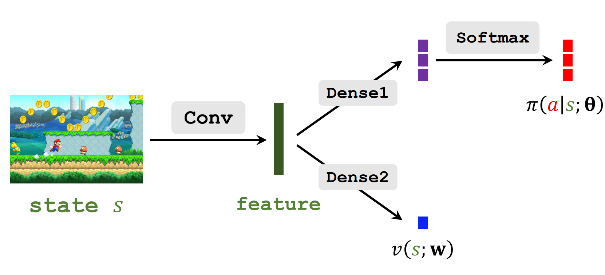

# 一、用到的神经网络

两个神经网络：

Policy network策略网络: $\pi(a \mid s, \boldsymbol{\theta})$

* 用来近似策略函数 $\pi(a \mid s)$
* 实际控制actor运动

Value network价值网络：$v(s;\mathbf{w})$

* 近似状态价值函数$V_{\pi}(s)$
* 它评价状态$s$有多好

**注意** 在之前我们用的是动作价值（网络）$q\left(s_t, a_t ; \mathbf{w}\right)$，但是$q\left(s_t, a_t ; \mathbf{w}\right)$与状态$s$和动作$t$都有关系，而$v(s;\mathbf{w})$只与状态有关，所以训练起来更好训练

# 二、训练

框架与上一节中reinforce相同

## 流程

* 1、每一轮观测到一个transition $(s_t,a_t,r_t s_{t+1})$
* 2、计算TD target: 

$$y_t=r_t+\gamma \cdot v(s_{t+1};\mathbf{w})$$

* 3、TD error

$${\delta}_t=v(s_t;\mathbf{w}) - y_t$$

* 4、更新策略网络：
$$ \mathbf{\theta}  \gets \mathbf{\theta} - \beta \cdot {\delta}_t \cdot \frac{\partial \ln \pi(a_t \mid s_t, \boldsymbol{\theta})}{\partial \boldsymbol{\theta}}$$

* 5、更新价值函数
$$ \mathbf{w} \gets \mathbf{w} - \alpha \cdot {\delta}_t  \frac{\partial v(s_t;\mathbf{w})}{\partial \mathbf{w}}$$

# 三、公式推导

## 3.1 价值函数的一些性质

折扣回报：

  $$ U_t=R_t+\gamma R_{t+1}+\gamma ^{2} R_{t+2}+ \gamma ^{3} R_{t+3}+\cdots $$

对**未来**的所有动作和状态求期望

  $$ Q_\pi\left(s_t, a_t\right)=\mathbb{E}\left[U_t \mid S_t=s_t, A_t=a_t\right] $$

进一步对**现在**的动作求期望

  $$V_\pi\left(s_t\right)=\mathbb{E}_A\left[Q_\pi\left(s_t, A\right)\right]$$

现在考虑TD target:

$$
Q\left(s_t, a_t\right) = \mathbb{E}_{S_{t+1},A_{t+1}}\left[R_t+\gamma \cdot Q\left(S_{t+1}, A_{t+1} ; \right)\right]
$$

期望是对$S_{t+1}$和$A_{t+1}$求的，而且$A_{t+1}$发生在$S_{t+1}$之后，将对$A_{t+1}$推导括号里面去可得:

$$
\begin{aligned}
Q\left(s_t, a_t\right) 
&= \mathbb{E}_{S_{t+1},A_{t+1}}\left[R_t+\gamma \cdot Q\left(S_{t+1}, A_{t+1} \right)\right]\\
&=\mathbb{E}_{S_{t+1}}\left[R_t+\gamma \cdot \mathbb{E}_{A_{t+1}} Q\left(S_{t+1}, A_{t+1} \right)\right]\\
&=\mathbb{E}_{S_{t+1}}\left[R_t+\gamma \cdot V_{\pi}(S_{t+1})\right]
\end{aligned}
$$

这里利用了$\mathbb{E}_{A_{t+1}} Q\left(S_{t+1}, A_{t+1} ; \right)=V_{\pi}(S_{t+1})$

得到**定理1**:
$$Q\left(s_t, a_t\right) = \mathbb{E}_{S_{t+1}}\left[R_t+\gamma \cdot V_{\pi}(S_{t+1})\right]$$

贝尔曼方程？？？

由于状态价值是动作价值关于当前动作的期望：

$$
\begin{aligned}
V_{\pi}(s_t) 
&= \mathbb{E}_{{A_t}}\left[Q_\pi \left(s_t, a_t\right)\right]\\
&= \mathbb{E}_{{A_t}} \left[\mathbb{E}_{S_{t+1}}\left[R_t+\gamma \cdot V_{\pi}(S_{t+1})\right]\right]\\
&=\mathbb{E}_{{A_t},S_{t+1}} \left[R_t+\gamma \cdot V_{\pi}(S_{t+1})\right]
\end{aligned}
$$

我们得到了定理二

$$V_{\pi}(s_t) = \mathbb{E}_{{A_t},S_{t+1}} \left[R_t+\gamma \cdot V_{\pi}(S_{t+1})\right]$$

## 3.2 蒙特卡洛近似

### 3.2.1 定理一的近似
定理一中要算期望：

$$Q\left(s_t, a_t\right) = \mathbb{E}_{S_{t+1}}\left[R_t+\gamma \cdot V_{\pi}(S_{t+1})\right]$$

对定理一中的期望做蒙特卡洛近似：
假设我们观测到一个transition $(s_t,a_t,r_t s_{t+1})$ 可以得到无偏估计：

$$Q_{\pi} \left(s_t, a_t\right) \approx  r_t+\gamma \cdot V_{\pi}(s_{t+1})$$

### 3.2.2 定理二的近似

$$V_{\pi}(s_t) = \mathbb{E}_{{A_t},S_{t+1}} \left[R_t+\gamma \cdot V_{\pi}(S_{t+1})\right]$$

假设我们观测到一个transition $(s_t,a_t,r_t s_{t+1})$ 可以得到无偏估计：

$$V_{\pi} \left(s_t \right) \approx  r_t+\gamma \cdot V_{\pi}(s_{t+1})$$

### 3.2.3 蒙特卡洛近似

根据定义这俩本身就是俩期望一样的随机变量，近似值的表达式相同是必然；然而由于是分别独立做观测（随机采样），实际观测值可以不同，只是形式上的表达式相同罢了

## 3.4 更新策略网络$\pi$

baseline的策略梯度：

$$\frac{\partial V(s_t)}{\partial \boldsymbol{\theta}} = = \mathbb{E}_{A_t \sim \pi}  \underbrace{ \left[\frac{\partial \ln \pi(A_t \mid s_t, \boldsymbol{\theta})}{\partial \boldsymbol{\theta}} \cdot (Q_\pi(s_t, A_t) -  V_{\pi}(s_t) ) \right]}_{g(A_t)}$$

策略梯度的蒙特卡洛近似为：
$$g(a_t)=\frac{\partial \ln \pi(a_t \mid s_t, \boldsymbol{\theta})}{\partial \boldsymbol{\theta}} \cdot (Q_\pi(s_t, a_t) -  V_{\pi}(s_t) )$$

$g(a_t)$是个随机梯度，$a_t$是做随机抽样得到的。$Q_\pi(s_t, a_t) -  V_{\pi}(s_t)$称为优势函数（Advantage function），所得到的方法称为 Advantage actor-critic方法（A2C）

现在函数中还不知道 $Q_\pi(s_t, a_t)$ 和 $V_{\pi}(s_t)$

使用定理一，替换$Q_\pi(s_t, a_t)$

可得

$$g(a_t)=\frac{\partial \ln \pi(a_t \mid s_t, \boldsymbol{\theta})}{\partial \boldsymbol{\theta}} \cdot (r_t+\gamma \cdot V_{\pi}(s_{t+1}) -  V_{\pi}(s_t))$$

进一步用神经网络$v(s;\mathbf{w})$近似状态价值函数$V_{\pi}(s_t)$：

$$g(a_t)=\frac{\partial \ln \pi(a_t \mid s_t, \boldsymbol{\theta})}{\partial \boldsymbol{\theta}} \cdot (r_t+\gamma \cdot v(s_{t+1};\mathbf{w}) - v(s_{t};\mathbf{w}))$$

令 $y_t = r_t+\gamma \cdot v(s_{t+1};\mathbf{w})$，它 其实就是TD-target

然后用梯度上升更新参数$\theta$

$$ \mathbf{\theta}  \gets \mathbf{\theta} + \beta \cdot \frac{\partial \ln \pi(a_t \mid s_t, \boldsymbol{\theta})}{\partial \boldsymbol{\theta}} \cdot (y_t -  v(s_t;\mathbf{w}))$$

## 3.5 更新价值网络$V$
TD target：

根据定理二的近似：

$$V_{\pi} \left(s_t\right) \approx  r_t+\gamma \cdot V_{\pi}(s_{t+1})$$

用价值网络近似更新价值函数$V$

$$v \left(s_t;\mathbf{w} \right) \approx  r_t+\gamma \cdot v(s_{t+1};\mathbf{w})$$

我们称 $y_t = r_t+\gamma \cdot v(s_{t+1};\mathbf{w})$ 为TD-target
$y_t$部分基于真实观测到的奖励，所以认为它比纯粹的估计更准确。

TD算法把TD-target $y_t$看作常数，并且估鼓励$v (s_t;\mathbf{w})$去接近$y_t$

下面用TD算法更新价值网络$v$

定义TD-error：
$${\delta}_t=v(s_t;\mathbf{w}) - y_t$$

我们希望${\delta}_t$越小越好，所以定义损失为${\delta}_t^2$

梯度：

$$  \frac{\partial {\delta}_t^2 / 2} {\partial \mathbf{w}} = {\delta}_t  \frac{\partial v(s_t;\mathbf{w})}{\partial \mathbf{w}}$$

然后做梯度下降，这样就可以让预测更接近TD-target $y_t$：

$$ \mathbf{w} \gets \mathbf{w} - \alpha \cdot {\delta}_t  \frac{\partial v(s_t;\mathbf{w})}{\partial \mathbf{w}}$$

# 一些通俗的解释

近似策略梯度：

$$g(a_t)=\frac{\partial \ln \pi(a_t \mid s_t, \boldsymbol{\theta})}{\partial \boldsymbol{\theta}} \cdot (\underbrace{r_t+\gamma \cdot v(s_{t+1};\mathbf{w})} - \underbrace{ v(s_{t};\mathbf{w})})$$

观察括号中的两部分，其中第二部分是在$t$时刻基于状态$s_t$对回报的估计，即$\mathbb{E}[U_t |s_t ]$

第一部分是在$t+1$时刻基于状态$s_t$和$s_t$对回报的估计，即$\mathbb{E}[U_t |s_t,s_{t+1} ]$

这两部分都是对回报的估计$\mathbb{E}[U_t]$，都是在评价$t$时刻状态$s_t$的好坏。但是第二部分是$t$时刻做出的预测，是动作$a_t$之前做出的预测，与$a_t$无关，左边的部分是在$t+1$时刻做出的预测，与$a_t$有关。$a_t$越好，左边的部分就越大，**差值**就是正的，这个差值反映了动作$a_t$带来的优势，叫做Advantage

综上所述，括号里的部分是**价值网络**对$a_t$的评价，$a_t$越好，这部分就越大。这部分用来指导策略网络的更新

