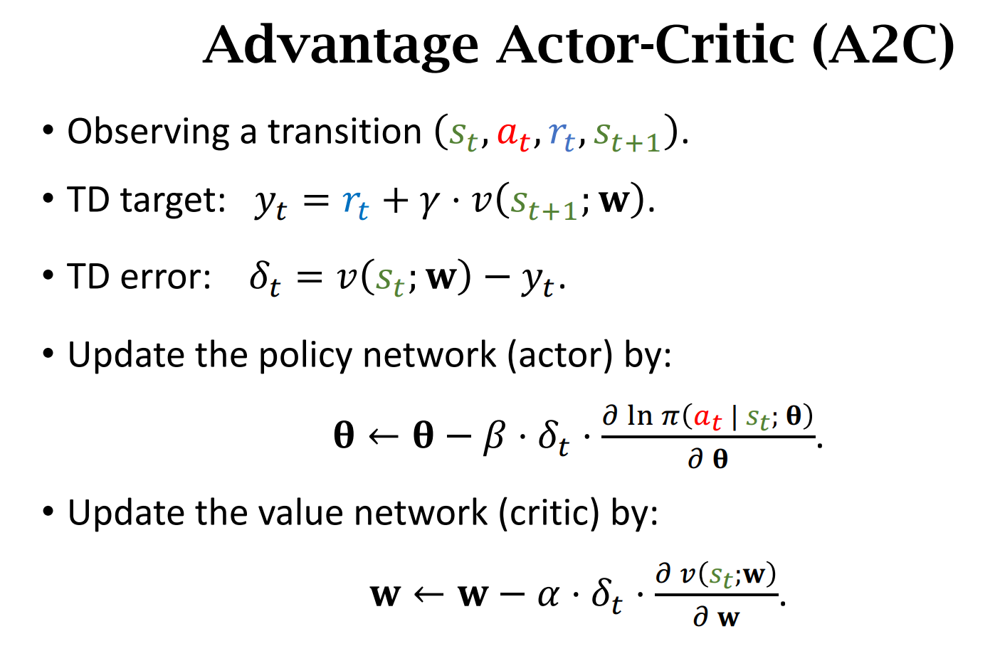
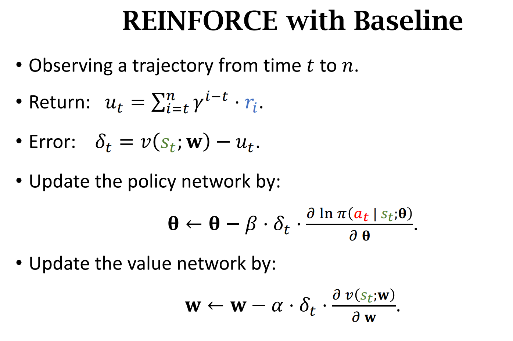
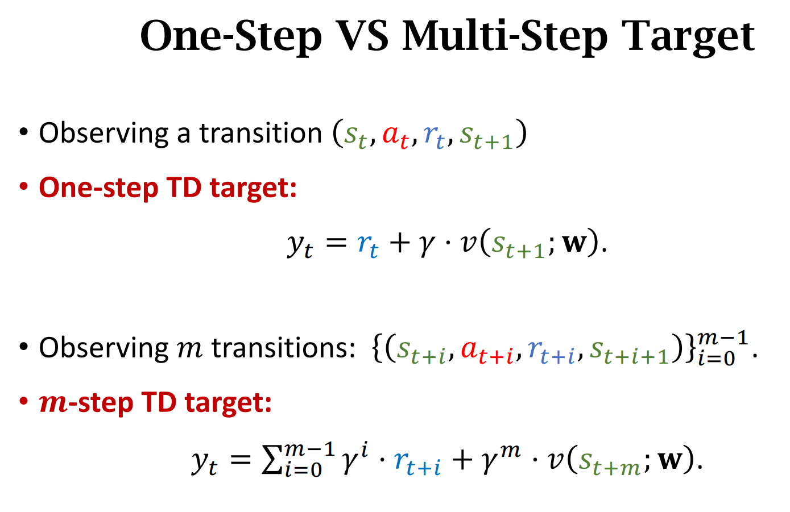
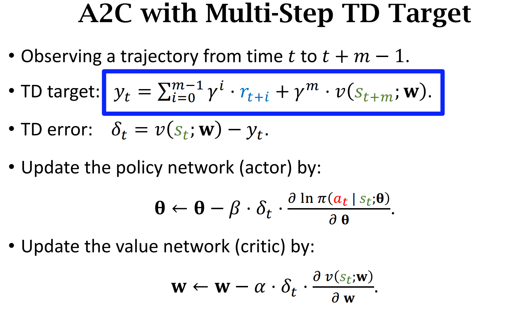
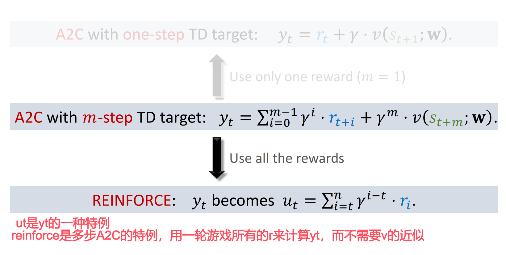

# 一、回顾

A2C算法:

REINFORCE with Baseline：

* 对比可以发现，这两种方法只是$u_t$和$y_t$不同

# 二、One-Step Target VS Multi-Step Target

m-step Target

A2C with m-step Target

m-step Target效果要比One-Step Target要好

# 联系

当利用一整局游戏时，m-step Target其实使用了从当前时刻到游戏结束所有的奖励，也就是回报return，那么后面的一项近似状态价值$v(s_{t+m};\mathbf{w})$就可以被丢掉了

算法也就变成了Reinforce

