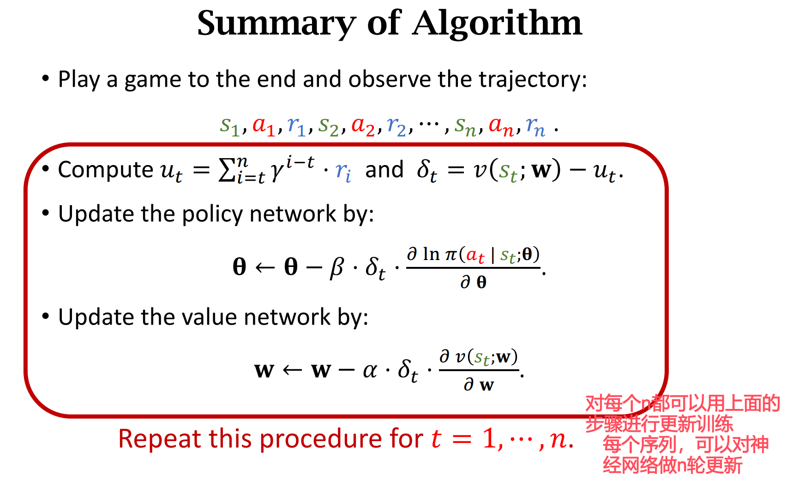

$$\frac{\partial V(s_t)}{\partial \boldsymbol{\theta}} = = \mathbb{E}_{A_t \sim \pi}  \underbrace{ \left[\frac{\partial \ln \pi(A_t \mid s_t, \boldsymbol{\theta})}{\partial \boldsymbol{\theta}} \cdot (Q_\pi(s_t, A_t) -  V_{\pi}(s_t) ) \right]}_{g(A_t)}$$

其中$V_{\pi}(s_t)$是baseline

# 一、使用蒙特卡洛近似求 $\frac{\partial \log \pi(A_t \mid s_t, \boldsymbol{\theta})}{\partial \boldsymbol{\theta}}$

期望是对于动作$A_t$求的，$A_t$的概率密度函数是策略网络$\pi$

使用蒙特卡洛方法，按照概率密度函数$\pi$进行抽样得到$a_t\sim \pi(\cdot \mid s ; \boldsymbol{\theta})$

得到的$g(a_t)$就是期望的蒙特卡洛近似，$g(a_t)$是策略梯度的一个无偏估计，把$g(a_t)$称作随机策略梯度

$$g(a_t)=\frac{\partial \ln \pi(a_t \mid s_t, \boldsymbol{\theta})}{\partial \boldsymbol{\theta}} \cdot (Q_\pi(s_t, a_t) -  V_{\pi}(s_t) )$$

# 二、使用蒙特卡洛近似 $Q_\pi(s_t, A_t)$

我们知道，动作价值函数是对折扣回报的期望：

$$ Q_\pi\left(s_t, a_t\right)=\mathbb{E}\left[U_t \mid S_t=s_t, A_t=a_t\right] $$

我们再做一次近似，拿**观测到**的回报$u_t$来近似回报，叫作**Reinforce**具体做法是，玩完一整轮游戏，观测到一整条轨迹。
从当前时刻的$s_t,a_t,r_t$一直到游戏结束的$s_n,a_n,r_n$
$$s_t,a_t,r_t, s_t+1,a_t+1,r_t+1,\space ... \space s_n,a_n,r_n$$

$t$时刻所有的回报做加权求和，即为$u_t$：
$u_t=\sum_{k=t}^T \gamma^{k-t} r_k$

$u_t$就是价值函数$Q_{\pi}(s_t,a_t)$的无偏估计

# 三、用神经网络近似状态价值$V_{\pi}(s_t)$

用神经网络$V(s;\mathbf{w})$来近似状态价值函数，称为价值网络

# 三次近似之后的策略梯度

$$\frac{\partial V(s_t)}{\partial \boldsymbol{\theta}} \approx 
g(a_t) 
\approx
\frac{\partial \ln \pi(a_t \mid s_t, \boldsymbol{\theta})}{\partial \boldsymbol{\theta}} \cdot (u_t -  v(s_t;\mathbf{w}))$$

整个过程一共需要两个神经网络，一个策略网络$\pi$，一个状态价值网络$V$

# 四、网络框架
## 4.1 策略网络$\pi(a_t \mid s_t, \boldsymbol{\theta})$

## 4.2 状态价值网络$v(s_t;\mathbf{w})$

将图像（状态）映射为实数

## 4.3 共享参数

两个网络都是使用卷积对图像特征进行提取，所以可以共享卷积层

# 五、网络训练过程

## 5.1 更新策略网络

通过上面的近似，我们有了近似的策略梯度：

$$\frac{\partial V(s_t)}{\partial \boldsymbol{\theta}} \approx 
\frac{\partial \ln \pi(a_t \mid s_t, \boldsymbol{\theta})}{\partial \boldsymbol{\theta}} \cdot (u_t -  v(s_t;\mathbf{w}))$$

之后，对做梯度上升（向着使状态价值增大的方向），更新策略网络的参数$\theta$：

$$ \mathbf{\theta}  \gets \mathbf{\theta} + \beta \cdot \frac{\partial \ln \pi(a_t \mid s_t, \boldsymbol{\theta})}{\partial \boldsymbol{\theta}} \cdot (u_t -  v(s_t;\mathbf{w}))$$

将$u_t -  v(s_t;\mathbf{w})$记为$-{\delta}_t$

梯度上升过程可以等价写为：

$$ \mathbf{\theta}  \gets \mathbf{\theta} - \beta \cdot {\delta}_t \cdot \frac{\partial \ln \pi(a_t \mid s_t, \boldsymbol{\theta})}{\partial \boldsymbol{\theta}}$$

## 5.1 更新状态价值网络

更新价值网络$v(s_t;\mathbf{w})$的方法就是让它更好的去拟合$u_t$

状态价值是对回报$U_t$的期望：

$$V_\pi\left(s_t\right)=\mathbb{E}_A\left[Q_\pi\left(s_t, A\right)\right]$$

训练价值网络$v(s_t;\mathbf{w})$的目标就是让他去接近状态价值$V_\pi\left(s_t\right)$

我们可以用观测到的$u_t$去拟合$V$

根据前面的约定，记：
${\delta}_t=v(s_t;\mathbf{w}) - u_t$

我们希望$v(s_t;\mathbf{w})$和$u_t$之间差距越小越好，所以将${{\delta}_t}^2$作为损失函数，然后做梯度下降，减小损失函数：

$$\frac{1}{2} \  \frac{\partial{{\delta}_t}^2}{\partial \mathbf{w}} = {\delta}_t  \frac{\partial v(s_t;\mathbf{w})}{\partial \mathbf{w}}$$

$$ \mathbf{w} \gets \mathbf{w} - \alpha \cdot {\delta}_t  \frac{\partial v(s_t;\mathbf{w})}{\partial \mathbf{w}}$$

# 六、总结

一条完整的轨迹有n个$u_t$，可以对神经网络做n轮更新

