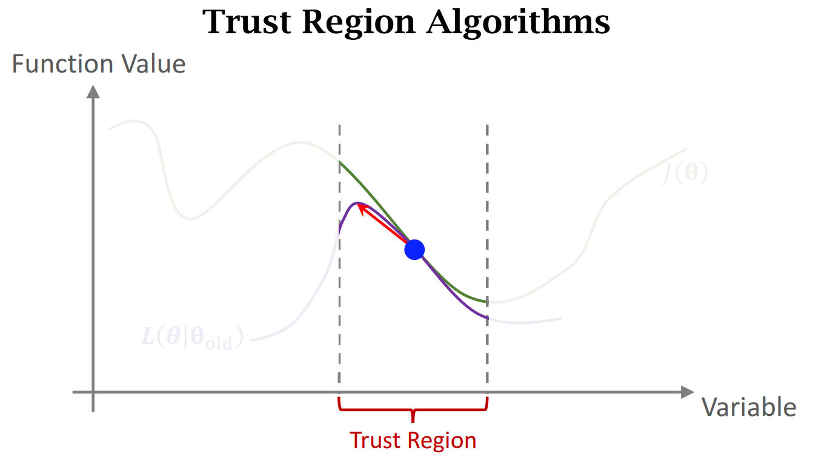
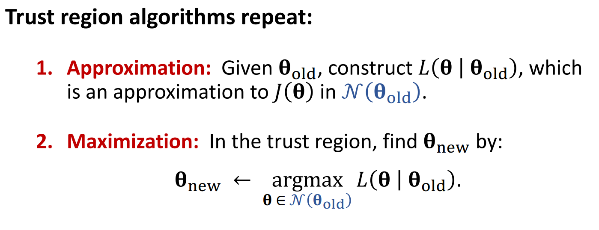
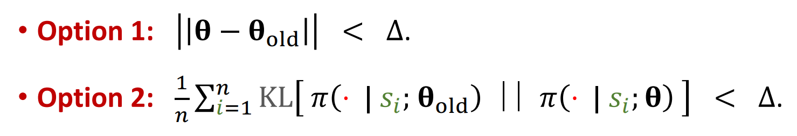
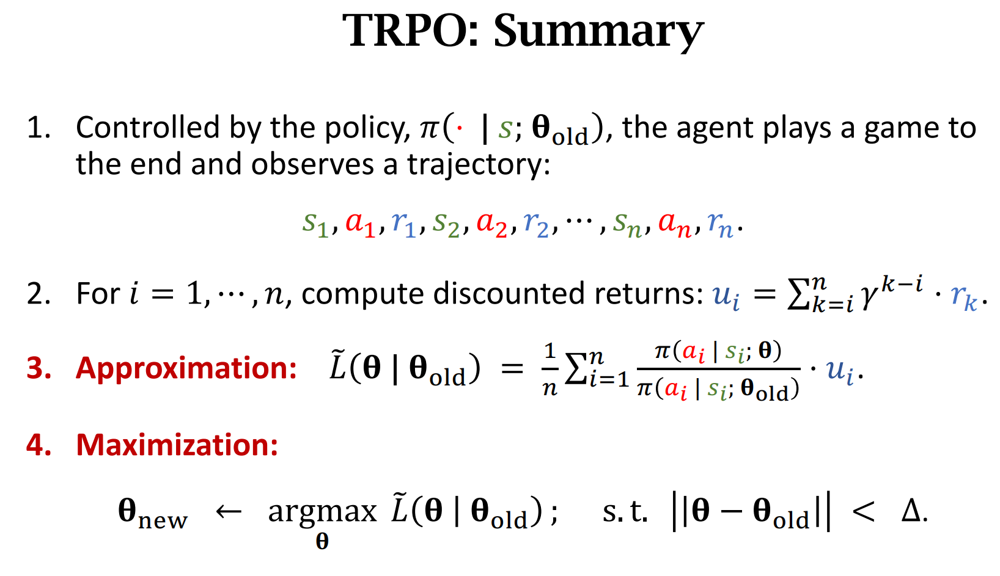

# 一、最大化问题的两种求解思路

考虑一个最大化问题：

$$\boldsymbol{\theta}^{\star} = \max_{\theta}J(\boldsymbol{\theta})$$

有两种方法，分别是梯度上升和置信域算法(Trust Region)

## 1.1 梯度上升

算法：

* 1.基于当前的参数$\boldsymbol{\theta}_{old}$，计算梯度$g=\frac{\partial J(\boldsymbol{\theta})}{\partial \boldsymbol{\theta}} |_{\boldsymbol{\theta}= \boldsymbol{\theta}_{old}}$
* 2.梯度上升：$\boldsymbol{\theta}_{new}={\theta}_{old}+\alpha \cdot g$

但是有时候，梯度是算不出来的，比如 $J(\boldsymbol{\theta})=\mathbb{E}_S[V(S ; \boldsymbol{\theta})]$ 求期望需要做积分，定积分有时候没有解析解，也就是求不出这个期望，也就求不出梯度。这时候就需要随机梯度：

随机梯度是对真实梯度的蒙特卡洛近似。

* 1.对随机变量$S$进行抽样，得到$s$
* 2.基于当前的参数$\boldsymbol{\theta}_{old}$，计算随机梯度$g=\frac{\partial V(s;\boldsymbol{\theta})}{\partial \boldsymbol{\theta}} |_{\theta=\boldsymbol{\theta}_{old}}$他是对目标函数在$\boldsymbol{\theta}_{old}$处梯度的蒙特卡洛近似
* 3.梯度上升：$\boldsymbol{\theta}_{new}={\boldsymbol{\theta}}_{old}+\alpha \cdot g$

## 1.2 置信域算法

* 令$\mathcal{N}(\boldsymbol{\theta}_{old})$是$\boldsymbol{\theta}_{old}$的邻域 满足：

$$\mathcal{N}(\boldsymbol{\theta}_{old}) =\left \{\boldsymbol{\theta}\mid  \left \|  \boldsymbol{\theta}-  \boldsymbol{\theta}_{old}    \right \|_2  \le  \Delta  \right\} $$

* 有这样一个函数，$L(\boldsymbol{\theta} \mid {\boldsymbol{\boldsymbol{\theta}}}_{old})$ 变量为$\theta$，并且依赖于${\theta}_{old}$。该函数在是$\boldsymbol{\theta}_{old}$的邻域$\mathcal{N}(\boldsymbol{\theta}_{old})$内十分接近$J(\boldsymbol{\theta})$，那么邻域$\mathcal{N}(\boldsymbol{\theta}_{old})$就被称为"Trust Region"置信域

在这个邻域上，我们可以用$L$来代替目标函数$J$，然后在这个邻域上对$L$来找最大化点。通常找的$J$函数是一个相对简单的函数，这样可以让优化变得更容易

置信域算法分为两步，分别为“做近似”和“最大化”：

构造$L$的方法有很多，可以是$J$的二阶泰勒展开，也可以是$J$的蒙特卡洛近似，只要在置信域内两个函数接近即可

最大化是带约束的最大化问题，求解比较慢。置信域算法计算量大，但是稳定

置信域的半径可以发生变化，通常让置信域逐渐变小

# 二、TRPO

## 2.1
复习策略学习：

$$V_\pi\left(s\right)=\mathbb{E}_{A \sim \pi}\left[Q_\pi\left(s, A\right)\right]=\sum_a \pi\left(a \mid s ; \boldsymbol{\theta}\right) \cdot Q_\pi\left(s, a\right) \\$$

$$J(\boldsymbol{\theta})=\mathbb{E}_S[V(S ; \boldsymbol{\theta})]$$

略微改变一下形式，在过程中，前面的一项可以看作是概率密度函数，那么整个连加就可以看作是对后面两项乘积的期望.（在数学上叫做重要性采样，见附1）

$$\begin{aligned}

V_\pi(s) & =\sum_a \pi(a \mid s ; \boldsymbol{\theta}) \cdot Q_\pi(s, a) \\
&= \mathbb{E}_{A \sim \pi\left(\cdot \mid s ; \boldsymbol{\theta} \right)}\left[ Q_\pi(s, A)\right]\\
& =\sum_a \pi\left(a \mid s ; \boldsymbol{\theta}_{\text {old }}\right) \cdot \frac{\pi(a \mid s ; \boldsymbol{\theta})}{\pi\left(a \mid s ; \boldsymbol{\theta}_{\text {old }}\right)} \cdot Q_\pi(s, a) \\
& =\mathbb{E}_{A \sim \pi\left(\cdot \mid s ; \boldsymbol{\theta}_{\text {old }}\right)}\left[\frac{\pi(A \mid s ; \boldsymbol{\theta})}{\pi\left(A \mid s ; \boldsymbol{\theta}_{\text {old }}\right)} \cdot Q_\pi(s, A)\right]
\end{aligned}$$

带入到$J(\boldsymbol{\theta})$中：

$$\begin{aligned}
J(\boldsymbol{\theta}) & =\mathbb{E}_S\left[V_\pi(S)\right] \\
& =\mathbb{E}_S\left[\mathbb{E}_A\left[\frac{\pi(A \mid S ; \boldsymbol{\theta})}{\pi\left(A \mid S ; \boldsymbol{\theta}_{\text {old }}\right)} \cdot Q_\pi(S, A)\right]\right]
\end{aligned}$$

得到一个期望的期望

## 2.2 相比较策略梯度算法的优点

* 策略梯度算法虽然快，但是表现不稳定。超参数设置敏感，学习率的设置对结果影响很大。训练过程的随机性大，训练过程的波动很大。收敛曲线剧烈上下波动
* TRPO算法主要优点在于稳定，对超参数不那么敏感，波动小。
* TRPO算法另一个优点在于sample efficiency。观测到同样数量的奖励，可以训练出更好的策略网络

## 2.3 步骤

### 2.3.1 做近似  Approximation

将目标函数$J(\boldsymbol{\theta})$在邻域$\boldsymbol{\theta}_{old}$内做近似。

首先写成期望的形式：

$$\begin{aligned}
J(\boldsymbol{\theta}) =\mathbb{E}_{S,A} \left[\frac{\pi(A \mid S ; \boldsymbol{\theta})}{\pi\left(A \mid S ; \boldsymbol{\theta}_{\text {old }}\right)} \cdot Q_\pi(S, A)\right]
\end{aligned}$$

需要求的参数是$\boldsymbol{\theta}$，期望是对环境$S$和动作$A$求的，将他们看作随机变量。

*  $S$是从环境的状态转移(state transition)函数中抽样得到的，我们不知道环境究竟是怎样做到状态转移，不知道状态转移函数
*  $A$是从策略 $\pi\left(A \mid s ; \boldsymbol{\theta}_{\text {old }}\right)$ 中随机抽样得到的 

做蒙特卡洛近似，首先要从环境中抽样得到$S$，再根据策略网络$\pi\left(A \mid s ; \boldsymbol{\theta}_{\text {old }}\right)$抽样得到动作$A$。其实就是让agent和环境交互，得到一整条trajectory:

$$s_1,a_1,r_1, s_2,a_2,r_2,\space ... \space s_n,a_n,r_n$$

用这条轨迹中的$a_i$和$s_i$做蒙特卡洛近似，用$n$项的均值更好得近似期望。$L\left(\boldsymbol{\theta} \mid \boldsymbol{\theta}_{\text {old }}\right)$就是目标函数 $J$ 的近似

$$L\left(\boldsymbol{\theta} \mid \boldsymbol{\theta}_{\text {old }}\right)=\frac{1}{n} \sum_{i=1}^n \frac{\pi\left(a_i \mid s_i ; \boldsymbol{\theta}\right)}{\pi\left(a_i \mid s_i ; \boldsymbol{\theta}_{\text {old }}\right)} \cdot Q_\pi\left(s_i, a_i\right)$$

式中仍有$Q_\pi$函数是未知的，下面对其做近似：

在一局游戏中，观测到所有奖励：

$$r_1,r_2, r_3,\space ... \space r_n$$

可以得到折扣回报:

$$u_i=\sum_{k=i}^T \gamma^{k-i} r_k$$

在"reinforce with baseline"章中，我们知道动作价值是折扣回报的期望，可以用折扣回报$u_i$近似动作价值（蒙特卡洛近似）：

$$Q_\pi\left(s_i, a_i\right) \approx u_i$$

代入可得$\tilde{L}$

$$\tilde{L}\left(\boldsymbol{\theta} \mid \boldsymbol{\theta}_{\text {old }}\right)=\frac{1}{n} \sum_{i=1}^n \frac{\pi\left(a_i \mid s_i ; \boldsymbol{\theta}\right)}{\pi\left(a_i \mid s_i ; \boldsymbol{\theta}_{\text {old }}\right)} \cdot Q_\pi\left(s_i, a_i\right)$$

### 2.3.1 最大化 Maximization

在置信域 $\mathcal{N}(\boldsymbol{\theta}_{old})$内寻找一个$\boldsymbol{\theta}_{new}$，使得：

$$\boldsymbol{\theta}_{\text {new }} \leftarrow \underset{\boldsymbol{\theta}}{\operatorname{argmax}} \tilde{L}\left(\boldsymbol{\theta} \mid \boldsymbol{\theta}_{\text {old }}\right) ; \quad \text { s.t. } \boldsymbol{\theta} \in \mathcal{N}\left(\boldsymbol{\theta}_{\text {old }}\right)$$

约束条件可以使得$\boldsymbol{\theta}_{new}$不至于离$\boldsymbol{\theta}_{old}$太远。虽然我们近似后的$J(\boldsymbol{\theta})$ 和原本的函数期望相同，但是我们后面又做了蒙特卡洛近似，用观测值去进一步替代期望。问题就是出在这里，见附录里面的$f(x)$和$f(x) * \frac{p}{q}$并不是一个函数，做蒙特卡洛近似求期望的时候，如果能有非常多的样本，确实是可以近似得到两个一样的期望的值，但是样本少的时候那可就不一定了。

注意 ${p}{q}$ 在算法中其实分别代表两个策略密度函数$\pi\left(\cdot \mid s ; \boldsymbol{\theta}_{\text {old }}\right)$和$\pi\left(\cdot \mid s ; \boldsymbol{\theta}\right)$

所以我们除了需要让这两个函数的期望一致以外（保证$J(\theta)$的推导过程等号），还要规定两个概率分布形状不能差太远(保证蒙特卡洛近似的准确)

这里介绍两种距离：

# 总结

对于第四步，带约束的最大化问题，通常用梯度投影算法求解，用梯度上升往往不能求解。

第四步有两个参数：梯度下降的不长和置信域的大小$\Delta$，但是算法对这两个参数不敏感，即便是参数不好，第四步的求解的结果不好，对TRPO的影响也不大。

# 附1 重要性采样

$f(x)$对$p$的期望可以转化成对$q$的期望：

$$\begin{aligned}
& E_{x \sim p}[f(x)]=\int f(x) * p d x \\
& =\int f(x) * p * \frac{q}{q} d x \\
& =\int f(x) * \frac{p}{q} * q d x \\
& E_{x \sim q}\left[f(x) * \frac{p}{q}\right]
\end{aligned}$$

但是呢，虽然两个期望都是一样的，但是他们的方差不一样

$$\begin{aligned}
& \operatorname{Var}_{x-p}[f(x)]=E_{x \sim p}\left[f(x)^2\right]-\left(E_{x \sim p}[f(x)]\right)^2 \\
& \operatorname{Var}_{x-q}\left[f(x) * \frac{p}{q}\right]=E_{x \sim q}\left[\left(f(x) * \frac{p}{q}\right)^2\right]-\left(E_{x \sim q}\left[f(x) * \frac{p}{q}\right]\right)^2 \\
& =\int f(x)^2 * \frac{p^2}{q^2} * q d x-\left(\int f(x)^2 * \frac{p}{q} * q d x\right)^2 \\
& =E_{x \sim p}\left[f(x)^2 \frac{p}{q}\right]-\left(E_{x \sim p}[f(x)]\right)^2
\end{aligned}$$