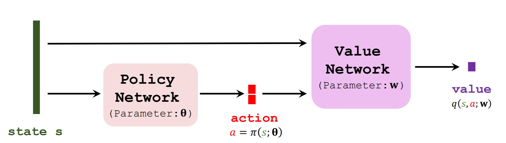

# 1、两种解决连续控制问题的思路

* 连续空间离散化（不好、略）当状态空间维度较高，或者动作细分较多时，参数量太大
* DPG

# 2、Deterministic Policy Gradient (DPG)

## 2.1概述
考虑这样的一个连续控制问题，这里有一个2自由度机械臂，动作空间均为连续的角度

DPG的网络结构类似于策略梯度算法(Policy Gradient)，由actor和critic组成：

actor负责指导agent做动作，critic负责评价动作的好坏

需要注意的是，这里的策略网络输出的是确定的动作。比如这里，$\pi(s;\boldsymbol{\theta})$有两个自由度的输出，并不是两个动作的概率是多少，而是具体的两个自由度动作的值。

我们在这里做一下符号表示形式的区分，

* 在离散控制的Policy Gradient算法中，策略网络写作$\pi(a,s;\boldsymbol{\theta})$，该函数是一个概率密度函数，输出的是产生每个动作的概率。假设我们一共有 上下左右 四个动作，则输出就是四维的，每个维度就是概率值，且总概率为1。（列表的索引表示是哪个动作，值表示选择这个动作的概率）
* 在DPG中，策略网络写作$\pi(s;\boldsymbol{\theta})$，该函数的输出是每个需要控制的不同动作确定的值，假设我们有两个维度的动作（两个自由度）需要控制，则函数的输出是二维的，每个维度就是该动作具体是多少（角度）。（列表的索引表示是哪个动作变量，值表示动作具体是多少）

## 2.2使用TD算法更新价值网络

* 首先观察到一个transition
  $$s_t,a_t,r_t, s_{t+1}$$

* 并且使用策略网络算出$t+1$时刻的动作$\tilde{a}_{t+1}=\pi(s;\boldsymbol{\theta})$ （注意，这个$\tilde{a}_{t+1}$并未执行，只是TD算法需要，这一点和之前的4、Actor-Critic章节相同）
* 分别用价值网络给为$a_t$和$\tilde{a}_{t+1}$两个动作打分，分别为$q_t=q(s_t,a_t;\mathbf{w}_t)$ 和 $q_{t+1}=(s_{t+1},\tilde{a}_{t+1};\mathbf{w}_t)$
* 计算TD error （是不是写反了？？）

$$\delta_t = q_t - (r_t+\gamma \cdot q_{t+1})$$

* 梯度下降更新：
$$ \mathbf{w} \gets \mathbf{w} - \alpha \cdot {\delta}_t  \frac{\partial q(s_t;\mathbf{w})}{\partial \mathbf{w}}$$

## 2.3更新策略网络

actor自己不知道自己动作的好坏，全凭critic的打分。

actor的目标就是让critic的评分变高

也就是说，更新策略网络的参数$\boldsymbol{\theta}$，使得策略网络的输出$q$变大

看图，输入$s$是不变的，价值网络的参数在更新策略网络参数时也是不变的（即$w$不变），唯一变化的就是策略网络的参数$\boldsymbol{\theta}$

所以我们用价值网络的输出$q_t=q(s,a;\mathbf{w})$对于策略网络的参数$\boldsymbol{\theta}$求梯度，得到**确定策略梯度(DPG)**：
$$\mathbf{g}=\frac{\partial q(s, \pi(s ; \boldsymbol{\theta}) ; \mathbf{w})}{\partial \boldsymbol{\theta}}=\frac{\partial a}{\partial \boldsymbol{\theta}} \cdot \frac{\partial q(s, a ; \mathbf{w})}{\partial a}$$

应用链式法则展开，这其实也就是让梯度让价值 $q$ 传播到动作 $a$。然后再传播到策略网络。

最后做梯度上升更新$\boldsymbol{\theta}$

$$ \mathbf{\theta}  \gets \mathbf{\theta} + \beta \cdot \mathbf{g}$$

这样可以让 $q()$ 变大，也就是评分更好

# 3、改进

前面介绍的适用于DQN的改进方法在这里仍然适用

* Target networks.
* Experience replay.
* Multi-step TD target

## 3.1 使用Target Network

# 4、两种策略梯度比较

最后，对随机策略梯度和确定策略梯度做比较

