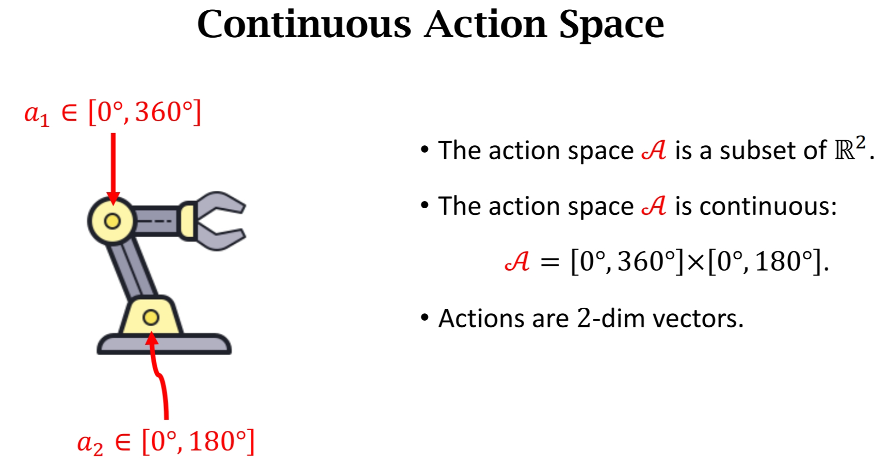

# 一、问题描述

首先考虑与前一章相同的连续控制问题：

# 二、搭建网络 Policy network 
## 一个自由度的情况

* 我们首先研究一个自由度的情况，动作空间${\color{red} \mathcal{A}}\subseteq \mathbb{R}$ 也就是说动作是个实数。

* 把均值记作$\mu$ ，标准差记作$\sigma$ ，且$\mu$和$\sigma$都是状态$s$的函数
* 用正态分布的函数$\mathcal{N}(\mu,\sigma^2)$作为策略密度函数
$$\pi(a \mid s)=\frac{1}{\sqrt{6.28} \sigma} \cdot \exp \left(-\frac{(a-\mu)^2}{2 \sigma^2}\right)$$

## 推广到多自由度的情况

* 把自由度的数量记为$d$，那么动作$\boldsymbol{a}$就是$d$维的向量
* 把均值记作$\boldsymbol{\mu}$ ，标准差记作$\boldsymbol{\sigma}$ 。其中$\boldsymbol{\mu}$和$\boldsymbol{\sigma}$是状态 ${s}$ 的函数 $\boldsymbol{\mu},\boldsymbol{\sigma}:\mathcal{S}\mapsto \mathbb{R}^d$

* $\boldsymbol{\mu}(s)$ 和 $\boldsymbol{\sigma}(s)$ 的输出都是d-dim的，其中$\mu_i$和$\sigma_i$是$\boldsymbol{\mu}(s)$ 和 $\boldsymbol{\sigma}(s)$ 的第$i$个元素。
* 则每一个维度的$\mu_i$和$\sigma_i$都是正态分布$\mathcal{N}(\mu_i,\sigma_i^2)$，动作$\boldsymbol{a}$就符合以下的多元正态概率密度分布：
$$\pi(\boldsymbol{a} \mid s)=\prod_{i=1}^d \frac{1}{\sqrt{6.28} \sigma_i} \cdot \exp \left(-\frac{\left(\boldsymbol{a}_i-\mu_i\right)^2}{2 \sigma_i^2}\right)$$

## 用神经网络近似$\boldsymbol{\mu}(s)$ 和 $\boldsymbol{\sigma}(s)$

我们不知道$\boldsymbol{\mu}(s)$ 和 $\boldsymbol{\sigma}(s)$的具体形式是什么，所以也就不知道$\pi(\mathrm{a} \mid s)$是什么，所以用神经网络近似

* 把均值函数$\boldsymbol{\mu}(s)$近似为神经网络$\boldsymbol{\mu}(s;\boldsymbol{\theta}^\mu)$. 其中$\boldsymbol{\theta}^\mu$是神经网络的参数
* 最好不要直接把方差$\boldsymbol{\sigma}(s)$近似为神经网络$\boldsymbol{\sigma}(s;\boldsymbol{\theta}^\sigma)$，因为效果不好。而是将对数方差近似为神将网络： 
* 令 $\rho_i=ln(\sigma_i^2)$ for $i=1,...d$ . 
用神经网络$\boldsymbol{\rho}(s;\boldsymbol{\theta}^\rho)$ 近似$\boldsymbol{\rho}$

## 用$\boldsymbol{\mu}(s)$ 和 $\boldsymbol{\sigma}(s)$搭建网络

神经网络两个输出共享卷积层参数，两个头分别输出$\boldsymbol{\rho}(s;\boldsymbol{\theta}^\rho)$和$\boldsymbol{\mu}(s;\boldsymbol{\theta}^\mu)$

## 做连续控制

* 每次观察到一个状态$s$，输入到神经网络，神经网络两个头分别输出方差对数$\hat{\boldsymbol{\rho}}=\boldsymbol{\rho}(s;\boldsymbol{\theta}^\rho)$和均值$\hat{\boldsymbol{\mu}}=\boldsymbol{\mu}(s;\boldsymbol{\theta}^\mu)$。他们都是d维的向量
* 对于每个维度$i=1,...d$. 计算每个维度的方差：$\hat{\sigma}_i^2=exp(\hat{\rho_i})$
* 按照输出的正太分布对每个动作进行采样$a_i \sim \mathcal{N}(\hat{\mu_i},\hat{\sigma}_i^2)$ for all  $i=1,...d$ . 

# 二、训练网络 Policy network 
两步：
* 搭建辅助网络Auxiliary network，帮助计算策略梯度policy gradient
* 用策略梯度方法训练策略网络

## Auxiliary network
首先有随机策略梯度（不带baseline）的形式如下：

$$g(a)=\frac{\partial \ln \pi(a \mid s, \boldsymbol{\theta})}{\partial \boldsymbol{\theta}} \cdot Q_\pi(s, a)$$

我们需要求出$\ln \pi(a \mid s, \boldsymbol{\theta})$

$\pi$其实是一个多元正太分布，动作$a$在均值$\mu$处出现的概率密度大，在远离$\mu$处的概率小

$$\pi(\boldsymbol{a} \mid s)=\prod_{i=1}^d \frac{1}{\sqrt{6.28} \sigma_i} \cdot \exp \left(-\frac{\left(\boldsymbol{a}_i-\mu_i\right)^2}{2 \sigma_i^2}\right)$$

虽然我们可以计算出$\pi$，但是实际上$\pi$在这里是没有意义的，我们只需要$\mu$和$\rho$来指导agent做动作，实际上用不到$\pi$

策略梯度公式的分子上是$\ln \pi(a \mid s, \boldsymbol{\theta})$ 对多元正态分布取ln，易得：
$$
\begin{aligned}
\ln \pi\left(\boldsymbol{a} \mid s ; \boldsymbol{\theta}^\mu, \boldsymbol{\theta}^\rho\right)
&=\sum_{i=1}^d\left[-\ln \sigma_i-\frac{\left(\boldsymbol{a}_i-\mu_i\right)^2}{2 \sigma_i^2}\right]+\mathrm{const}\\
&= \sum_{i=1}^d\left[-\ln \sigma_i-\frac{\left(\boldsymbol{a}_i-\mu_i\right)^2}{2 exp(\sigma_i^2)}\right]+\mathrm{const}
\end{aligned}
$$
其中，因为网络的输出其实没有$\sigma_i^2$而是${\rho_i}$，所以做了替换。

将辅助神经网络$f(s,\boldsymbol{a};\boldsymbol{\theta})$近似非常数项，即
$$
\begin{aligned}
\ln \pi\left(\boldsymbol{a} \mid s ; \boldsymbol{\theta}\right)
= \underbrace{\sum_{i=1}^d\left[-\ln \sigma_i-\frac{\left(\boldsymbol{a}_i-\mu_i\right)^2}{2 exp(\sigma_i^2)}\right]}_{f(s,\boldsymbol{a};\boldsymbol{\theta})} + \mathrm{const}
\end{aligned}
$$

函数$f(s,\boldsymbol{a};\boldsymbol{\theta})$的输入是状态$s$和动作$a$，当然，也可以看作是$\boldsymbol{\mu}$ 和 $\boldsymbol{\sigma}$和动作$a$的函数。他将$\boldsymbol{\mu}$ 和 $\boldsymbol{\sigma}$和动作$a$映射为一个实数，作为辅助神经网络的输出。

## 计算梯度$\frac{\partial f}{\partial \theta}$
计算梯度$\frac{\partial f}{\partial \theta}$，pytorch反向传播可以自动计算梯度：

## 三个神经网络

三个神经网络：

* $\boldsymbol{\mu}(s;\boldsymbol{\theta}^\mu)$  计算均值
* $\boldsymbol{\rho}(s;\boldsymbol{\theta}^\rho)$  计算方差对数
*  $f(s,\boldsymbol{a};\boldsymbol{\theta})$   其中$\boldsymbol{\theta}$ 包括 $\boldsymbol{\theta}^\mu$ 和$\boldsymbol{\theta}^\rho$。只用来帮助训练，不指导agent做动作。

##

$$g(a)=\frac{\partial \ln \pi(a \mid s, \boldsymbol{\theta})}{\partial \boldsymbol{\theta}} \cdot Q_\pi(s, a)$$

式中，由于$\ln \pi(a \mid s, \boldsymbol{\theta})$和$f(s,\boldsymbol{a};\boldsymbol{\theta})$之间只差一个常数

$$
\begin{aligned}
\ln \pi\left(\boldsymbol{a} \mid s ; \boldsymbol{\theta}\right)
= f(s,\boldsymbol{a};\boldsymbol{\theta})+ \mathrm{const}
\end{aligned}
$$

在求梯度时，常数可以略去。所以可以用$f(s,\boldsymbol{a};\boldsymbol{\theta})$替换$\ln \pi(a \mid s, \boldsymbol{\theta})$

$$g(a)=\frac{\partial f(s,\boldsymbol{a};\boldsymbol{\theta})}{\partial \boldsymbol{\theta}} \cdot Q_\pi(s, a)$$

然而$Q_\pi(s, a)$还是未知的，可以用之前的方法例如reinforce或者AC方法近似

## reinforce

蒙特卡洛

用观测到的$u_t$近似$Q_\pi(s, a)$

$u_t$是从$t$时刻开始未来所有奖励的加权和$u_t=\sum_{k=t}^T \gamma^{k-t} r_k$

梯度上升更新参数$\boldsymbol{\theta}$：

$$ \mathbf{\theta}  \gets \mathbf{\theta} + \beta \cdot   \frac{\partial f(s,\boldsymbol{a};\boldsymbol{\theta})}{\partial \boldsymbol{\theta}} \cdot u_t$$

## actor-critic

1、将$Q_\pi(s, a)$近似为价值网络$q\left(s, \boldsymbol{a}; \mathbf{w} \right)$

2、梯度上升更新策略参数$\boldsymbol{\theta}$：
$$ \mathbf{\theta}  \gets \mathbf{\theta} + \beta \cdot   \frac{\partial f(s,\boldsymbol{a};\boldsymbol{\theta})}{\partial \boldsymbol{\theta}} \cdot q\left(s, \boldsymbol{a}; \mathbf{w} \right)$$

3、使用TD算法训练价值网络的参数$\mathbf{w}$

# 改进

用带baseline的策略网络

reinforce ==> reinforce with baseline

Actor-Critic ==> Advangetage Actor-Critic(A2C)